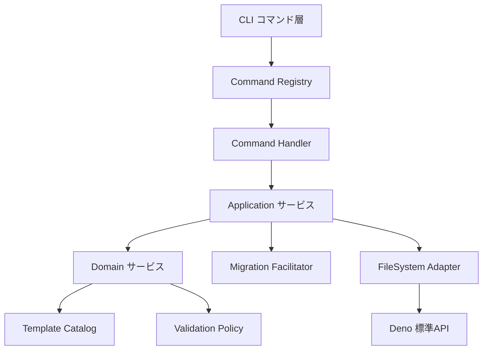
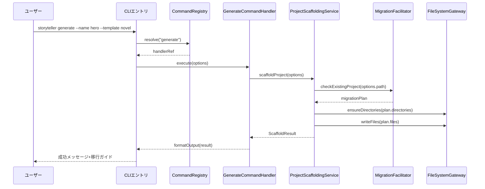
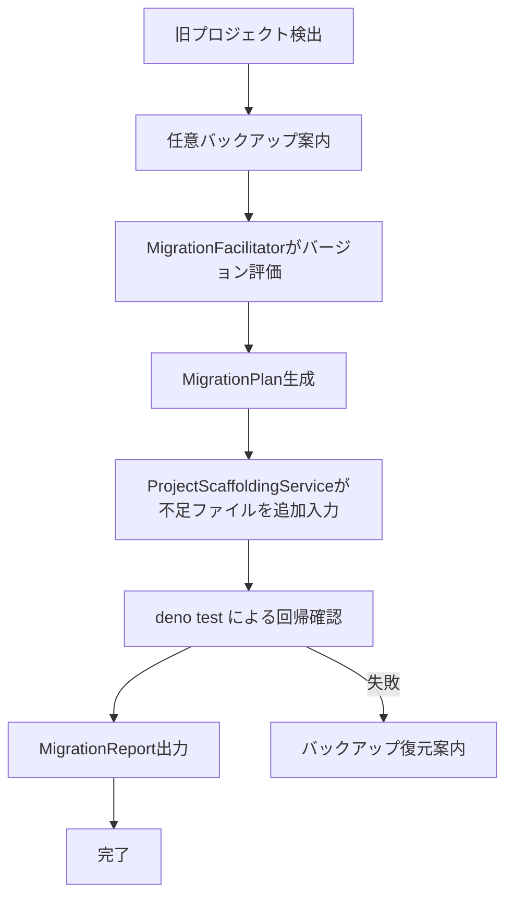

# Design Document

## Overview

Street
Storytellerの現行CLIは単一のコマンドルーターとベタ書きのテンプレート生成コードで構成されており、責務境界が曖昧なため機能追加ごとに既存ファイルを直接編集する必要がある。本設計ではIssue
#7で求められているレイヤ化と依存逆転を導入し、CLIコマンドとドメインサービスを疎結合化する。TDDを中心に据えたモジュール構造を採用し、プロジェクト生成や将来のAI/LSP統合を安全に拡張できる足場を提供する。

想定ユーザーはStreet
Storytellerのコア開発者とCLI拡張開発者であり、彼らは新しいコマンドを追加したり既存テンプレートを拡張する際に最小限の接点変更で済むようになる。既存ユーザーは新アーキテクチャ下でも旧テンプレート構造を保ちながら移行ガイドに従って安全にアップグレードできる。

### Goals

- CLI・アプリケーション・ドメイン・インフラの境界を明示し拡張ポイントを公開する。
- TDDサイクルを支援するテスト構成とモック可能なアダプタを提供する。
- 旧プロジェクト構成との後方互換性と移行手順を整備する。

### Non-Goals

- GUIやWeb UIの提供は対象外とする。
- LSPサーバーやAI統合そのものの実装は別イシューで扱う。
- Deno以外のランタイム対応は考慮しない。

## Architecture

### Existing Architecture Analysis

- `main.ts`は`runCLI()`を直接呼び出し、`src/cli.ts`内でコマンド判定と生成処理を行っている。
- `generateStoryProject`はディレクトリ作成からテンプレート描画、ファイル書き込みまでを単一関数に束ねている。
- ドメイン型(`src/type/*.ts`)は存在するが、CLIからの利用は単純なテンプレート文字列に留まっている。
- テストはCLIモックとファイル生成の確認に集中しており、ドメイン分離がないためテスト対象が肥大化している。

### 高レベルアーキテクチャ



- 既存パターン継承:
  Deno標準ライブラリ利用、CLIエントリーポイント構成を維持する。
- 新規コンポーネント: Command Registry、Applicationサービス、Migration
  Facilitator、FileSystem Adapter。
- 技術整合性: すべてTypeScript + Deno 2.xで完結し、外部依存を増やさない。
- ステアリング遵守:
  SaCコンセプトに沿ってドメイン層を明示し、サンプル実装のハイブリッド構造を参照できるようにする。

### Technology Alignment and Key Design Decisions

#### テクノロジー整合

- CLIレイヤは既存の`jsr:@std/cli/parse-args`を継続利用し、Command
  Registry経由で新規ハンドラを疎結合登録する。
- Application層は純粋なTypeScriptで構成し、I/OはInfrastructure層のアダプタを介して行う。
- ドメイン層はStory要素の型定義を再利用しつつ、テンプレート定義と生成ポリシーを集約する。

#### Key Design Decisions

- **Decision**: Command
  Registryとハンドラを分離したプラグイン登録方式を採用する。
  - **Context**: Requirement
    1.1で求められる既存ファイル編集不要の拡張性を実現する必要がある。
  - **Alternatives**: a) 既存スイッチ文にcase追加 b)
    メタプログラミングで自動検出 c) DIコンテナを導入。
  - **Selected Approach**: Command
    Registryに`registerModule(CommandModule)`を公開し、モジュール側で自己登録する設計。
  - **Rationale**:
    Deno環境で軽量に実装でき、テスト時にモックレジストリを差し込める。
  - **Trade-offs**:
    実行時登録順序の管理が必要になるが、テストで順序保証を検証することで制御可能。
- **Decision**: FileSystemアクセスを`FileSystemGateway`抽象化でラップする。
  - **Context**: Requirement 2.3が示すTDD向けモック容易性を確保したい。
  - **Alternatives**: a) 直接`Deno` API呼び出し b) グローバルモック注入 c)
    Adapterパターン。
  - **Selected Approach**:
    Adapterパターンで同期・非同期I/Oを統一インターフェース化する。
  - **Rationale**:
    非同期APIを含むため統一インターフェースをもたせることでテスト・移植が容易。
  - **Trade-offs**: アダプタ層の実装コストが増えるが、モック生成で回収できる。
- **Decision**: Migration
  Facilitatorを分離してバージョン差分検出と移行手順通知を担当させる。
  - **Context**: Requirement 3.3と3.4で求められる差分通知とガイド提示が必要。
  - **Alternatives**: a) Applicationサービスに埋め込む b) CLI側で判定 c)
    専用コンポーネント。
  - **Selected Approach**:
    Applicationサービスから呼び出される専用コンポーネントとし、将来の移行コマンドにも再利用する。
  - **Rationale**: 責務が独立しており、テスト可能性が高い。
  - **Trade-offs**:
    コンポーネント間の連携設計が増えるが、Traceabilityが明確になる。

## System Flows



## Requirements Traceability

| Requirement | Summary                      | Components                                                       | Interfaces                                                                 | Flows                |
| ----------- | ---------------------------- | ---------------------------------------------------------------- | -------------------------------------------------------------------------- | -------------------- |
| 1.1         | 既存編集不要の拡張ポイント   | CommandRegistry, CommandModule                                   | `CommandRegistry.registerModule`, `CommandModule.activate`                 | System Flow          |
| 1.2         | 抽象化されたドメインアクセス | GenerateCommandHandler, ProjectScaffoldingService, DomainService | `ProjectScaffoldingService.generate`, `StoryDomainService.resolveTemplate` | System Flow          |
| 1.3         | 層分離                       | 全レイヤ                                                         | レイヤ境界契約                                                             | Architecture Diagram |
| 1.4         | サンプル整合                 | TemplateCatalog                                                  | `TemplateCatalog.listExamples`                                             | N/A                  |
| 2.1         | テストスイート分離           | Test Harness, ProjectScaffoldingService                          | `TestSuiteRunner.runSuite`                                                 | N/A                  |
| 2.2         | テストスタブ必須             | CommandRegistry                                                  | `CommandRegistry.validateRegistration`                                     | N/A                  |
| 2.3         | I/O抽象化                    | FileSystemGateway                                                | `FileSystemGateway`各メソッド                                              | System Flow          |
| 2.4         | TDDガイド提示                | DocumentationEmitter                                             | `DocumentationEmitter.emitTddGuide`                                        | N/A                  |
| 3.1         | 新テンプレート互換           | ProjectScaffoldingService                                        | `ProjectBlueprint`                                                         | System Flow          |
| 3.2         | 自動移行支援                 | MigrationFacilitator                                             | `MigrationPlan`                                                            | Migration Flow       |
| 3.3         | バージョン通知               | MigrationFacilitator                                             | `MigrationReport`                                                          | Migration Flow       |
| 3.4         | ガイドライン明示             | DocumentationEmitter                                             | `DocumentationEmitter.emitMigrationGuide`                                  | Migration Flow       |

## Components and Interfaces

### CLI Layer

#### CommandRegistry

**Responsibility & Boundaries**

- Primary Responsibility: コマンドモジュールの登録とハンドラ解決。
- Domain Boundary: Interface/CLI層。
- Data Ownership: コマンド名とハンドラのマッピング。
- Transaction Boundary: 単一CLIリクエスト内。

**Dependencies**

- Inbound: CLIエントリ。
- Outbound: CommandModule。
- External: なし。

**Contract Definition**

```typescript
interface CommandModule {
  readonly name: string;
  activate(registry: CommandRegistry): void;
}

interface CommandRegistry {
  register(handler: CommandHandler): void;
  resolve(commandName: string): CommandHandler | undefined;
  validate(): Result<void, CommandRegistrationError>;
}
```

- Preconditions: `register`呼び出しはユニークなコマンド名であること。
- Postconditions: `validate`成功時は重複と未登録依存が存在しない。

#### CLIEntryPoint

- Primary Responsibility:
  `parseArgs`を利用してCommandRegistryからハンドラを取得し実行する。
- Outbound Dependencies: CommandRegistry, OutputPresenter。

### Application Layer

#### GenerateCommandHandler

- Primary Responsibility: CLI引数を検証し、ProjectScaffoldingServiceに委譲する。
- Domain Boundary: Application層。
- Data Ownership: CLIオプションDTO。
- Dependencies: ProjectScaffoldingService, OutputPresenter。

```typescript
interface GenerateCommandHandler extends CommandHandler {
  execute(
    options: GenerateOptions,
  ): Promise<Result<ScaffoldResult, GenerateError>>;
}
```

#### ProjectScaffoldingService

- Primary Responsibility:
  テンプレート解決、ディレクトリ作成、ファイル生成、移行フック呼び出し。
- Dependencies: StoryDomainService, FileSystemGateway, MigrationFacilitator,
  DocumentationEmitter。

```typescript
interface ProjectScaffoldingService {
  generate(
    options: GenerateOptions,
  ): Promise<Result<ScaffoldResult, ScaffoldError>>;
}
```

- Preconditions: `options`に有効なテンプレートが指定されている。
- Postconditions: ファイル生成と移行レポートが整合する。

#### MigrationFacilitator

- Primary Responsibility: 既存プロジェクトのバージョン検出、移行手順生成、通知。
- Dependencies: FileSystemGateway, MigrationPolicy。

```typescript
interface MigrationFacilitator {
  assess(path: ProjectPath): Promise<MigrationPlan>;
  emitReport(plan: MigrationPlan): MigrationReport;
}
```

#### DocumentationEmitter

- Primary Responsibility: TDDガイド・移行ガイド・CLIメッセージ生成。
- Dependencies: TemplateCatalog。

### Domain Layer

#### StoryDomainService

- Primary Responsibility: テンプレート選択、Story要素の整合性検証。
- Dependencies: TemplateCatalog, ValidationPolicy。

```typescript
interface StoryDomainService {
  resolveTemplate(
    template: TemplateId,
  ): Result<ProjectBlueprint, TemplateError>;
  validateBlueprint(blueprint: ProjectBlueprint): Result<void, ValidationError>;
}
```

#### TemplateCatalog

- Primary Responsibility:
  `basic`/`novel`/`screenplay`などのテンプレートブループリント提供とサンプル参照。
- Data Ownership: テンプレートメタデータ。

#### ValidationPolicy

- Primary Responsibility: ブループリントとStory型定義の整合ルール提供。

### Infrastructure Layer

#### FileSystemGateway

- Primary Responsibility:
  ディレクトリ作成、ファイル出力、存在確認、バックアップ。
- Outbound Dependencies: `Deno` API。

```typescript
interface FileSystemGateway {
  ensureDir(path: string): Promise<Result<void, FileSystemError>>;
  writeFile(
    path: string,
    content: string,
  ): Promise<Result<void, FileSystemError>>;
  exists(path: string): Promise<Result<boolean, FileSystemError>>;
  readFile(path: string): Promise<Result<string, FileSystemError>>;
}
```

#### MigrationPolicy

- Primary Responsibility: 旧構造との互換性規則とバージョンタグの定義。

### Cross-Cutting Utilities

#### Result 型

```typescript
type Result<T, E> = { ok: true; value: T } | { ok: false; error: E };
```

- 全層で同期/非同期問わず戻り値を統一し、例外乱用を避ける。

## Data Models

- `GenerateOptions`: CLI入力DTO (`name`, `template`, `path`)。
- `ProjectBlueprint`:
  テンプレートに基づく生成計画。`directories: DirectorySpec[]`、`files: FileSpec[]`を保持。
- `MigrationPlan`: 既存プロジェクト検出結果（`status`, `actions`, `warnings`）。
- `MigrationReport`: ユーザー向けログ文とガイドリンク。
- `ScaffoldResult`: 成功時の出力内容、移行通知、警告リスト。

## Error Handling

### Error Strategy

- すべてのサービスは`Result`型で失敗を返し、CLI層で一元ログ出力する。
- CommandRegistry検証失敗は初期化段階で即座に終了させ、詳細をstderrに出力。

### Error Categories and Responses

- User Errors: 無効テンプレート指定、既存ディレクトリ競合 →
  使用方法ガイドを提示。
- System Errors: ファイル書き込み失敗、権限不足 → 失敗箇所と再実行指針を提示。
- Business Logic Errors: テンプレート整合性違反 →
  テンプレート定義・Story型の修正指示。

### Monitoring

- CLIはエラーログを構造化JSONで出力するオプションを提供し、CIで解析可能にする。

## Testing Strategy

- Unit Tests:
  CommandRegistry登録・検証、MigrationFacilitatorのバージョン判定、StoryDomainServiceのテンプレート解決。
- Integration Tests:
  GenerateCommandHandler→ProjectScaffoldingServiceの結合、FileSystemGatewayをモックしたディレクトリ生成、MigrationPlan生成と報告。
- E2E Tests:
  `deno task generate`で生成されたプロジェクト構造のスモークテスト、移行ガイド出力の確認。
- Performance:
  大規模テンプレート生成時のファイル数上限テスト、モックFSでの並列生成負荷試験。

## Migration Strategy



- Phase 1:
  プロジェクトルートで`.street-story.json`等のマニフェスト有無を確認し、なければ「旧構成」と判定。
- Phase 2: 既存生成物をバックアップするガイダンスをCLIが提示。
- Phase 3:
  MigrationFacilitatorが不足ファイル・設定の差分一覧を`MigrationPlan`にまとめる。
- Phase 4: Applicationサービスが必要ファイルを追加し、旧ファイルは温存する。
- Phase 5: `deno test`を推奨し、失敗時はバックアップからの復元手順を案内する。
