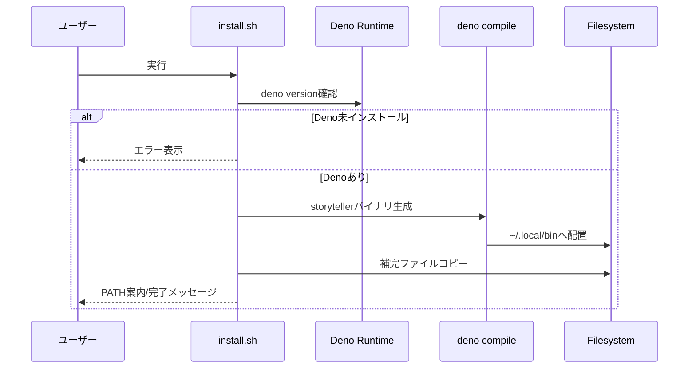
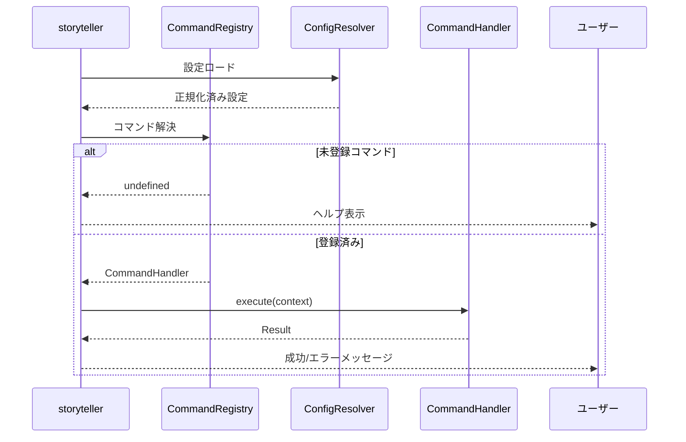
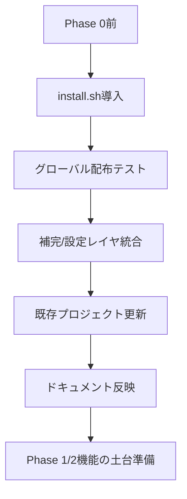

# Design Document

## Overview
本機能はStreet Storyteller CLIのPhase 0基盤を整備し、開発者と執筆者がどの環境からでも`storyteller`コマンドを安定的かつ拡張しやすい形で利用できるようにする。バイナリ配布、モジュール化されたコマンドディスパッチ、シェル補完、ヘルプ/エラーメッセージ改善、設定管理の整備を通じて、後続のIssue (#2〜#5) が依存するCLI土台を構築する。
CLI利用者（物語制作者、開発チーム）は統一されたタスク実行や補完による操作性向上を得られ、コア開発者は再配布やテスト自動化を容易にできる。これにより既存のプロトタイプ的CLIから、配布可能なプロダクト品質の基盤へと移行する。

### Goals
- `deno compile`成果物とインストール/アンインストールフローを確立し、グローバルに`storyteller`を利用可能にする。
- コマンド登録・解決・ヘルプ出力・補完機能をモジュール化し、将来のサブコマンド追加を低コスト化する。
- 設定ファイルと環境変数の優先度を定義し、利用者が動作を柔軟に切り替えられるようにする。

### Non-Goals
- CLI以外のUI（Web/GUI）やLSPサーバー本体の実装。
- 外部API連携（LLM、クラウドサービス）に関する処理。
- 複数OS向けパッケージ管理（Homebrew、Winget等）への対応は将来検討とする。

## Architecture

### Existing Architecture Analysis
- 現状のCLIは`main.ts`→`src/cli.ts`→Command Registry→個別モジュールというレイヤ構造を採用している。
- `deno.json`には既に`deno compile`によるビルドタスクが存在するが、インストール/アンインストールや補完スクリプトは未整備であり、配布プロセスが不足している。
- Command Registryは重複チェックと依存検証まで実装済みであるため、Phase 0ではこれを活用しつつヘルプ・補完・設定読み込みの拡張ポイントを追加する。
- 既存のテンプレート生成ドメインとは疎結合なため、CLI層の改修に留めることで影響範囲を限定する。

### High-Level Architecture
```mermaid
graph TD
    A[利用者環境] -->|install.sh| B[配布レイヤ]
    B --> C[storyteller バイナリ]
    C --> D[CLIエントリポイント]
    D --> E[Command Registry]
    E --> F[コマンドモジュール群]
    D --> G[ヘルプ/エラーハンドラ]
    D --> H[補完エンジン]
    D --> I[設定リゾルバ]
    I --> J[グローバル設定(~/.storytellerrc)]
    I --> K[プロジェクト設定(.storytellerrc)]
    I --> L[環境変数]
```

**Architecture Integration**
- 既存パターン継承: `main.ts`→`runCLI()`の流れ、Command Registryによるモジュール登録。
- 新規コンポーネント: 配布レイヤ（ビルド/インストールスクリプト）、補完エンジン、設定リゾルバ、拡張ヘルプハンドラ。
- 技術整合: DenoランタイムとJSR経由の標準ライブラリのみを使用し、外部依存を追加しない。
- ステアリング遵守: CLI層の責務分離を維持し、`sample/`で提示される将来アーキテクチャと整合する拡張ポイントを設置する。

### Technology Alignment and Key Design Decisions
- **Technology Alignment**: タスク実行・ビルドは既存の`deno.json`タスクに統合し、追加スクリプトは`bash`で実装する。設定ファイルはYAMLではなくJSON/TOMLを避け、Deno標準の`JSONC`パーサーを利用するシンプルなJSON形式を採用する。

**Key Design Decisions**
1. **Decision**: インストール/アンインストールをPOSIX準拠の`install.sh`/`uninstall.sh`で提供する。
   - **Context**: 多様なUNIX系環境で手動配布が必要。
   - **Alternatives**: a) Denoタスク内で直接コピー b) Makefile導入 c) Node製スクリプト。
   - **Selected Approach**: `install.sh`はDeno存在確認→ビルド→`~/.local/bin`への配置→補完配置→PATH案内を行う。
   - **Rationale**: 依存を増やさず、既存ドキュメントと親和性の高い配布方式。
   - **Trade-offs**: Windows向けPowerShellスクリプトは別途要検討。
2. **Decision**: 設定リゾルバをConfigResolverサービスとして定義し、グローバル→プロジェクト→環境変数の優先度を統一処理する。
   - **Context**: Requirement 5が示す優先順位とフォールバック要件。
   - **Alternatives**: a) 各コマンドで個別に設定読み込み b) DIコンテナで値注入 c) 環境変数のみ使用。
   - **Selected Approach**: CLIエントリポイントで一度解決し、Command Contextへ注入する。
   - **Rationale**: テスト容易性と一貫した挙動を両立。
   - **Trade-offs**: 設定変更時はCLI再起動が必要。
3. **Decision**: 補完エンジンを静的テンプレート + 動的候補プロバイダのハイブリッドで生成する。
   - **Context**: Requirement 3で静的/動的補完の両立が求められる。
   - **Alternatives**: a) 補完を完全静的ファイルに埋め込む b) 補完時にCLIを都度起動 c) 外部ツール依存。
   - **Selected Approach**: 静的補完ファイル内で`storyteller __complete`サブコマンドを呼び出し、CLI側が候補を返す。
   - **Rationale**: 動的候補を提供しつつ補完スクリプトをシンプルに保つ。
   - **Trade-offs**: 補完性能はCLI起動コストに依存するためキャッシュ戦略を後続で検討。

## System Flows

### インストールフロー


### CLI実行フロー


## Requirements Traceability
- **Req 1.1〜1.4**: `install.sh`、`uninstall.sh`、`BuildTask`、`DistributionManager`で実現。
- **Req 2.1〜2.4**: 既存`CommandRegistry`強化、`ModuleActivator`契約、`HelpPresenter`で対応。
- **Req 3.1〜3.4**: `CompletionEngine`、`completion/_storyteller`、`CompletionProvider`サブコマンドで提供。
- **Req 4.1〜4.4**: `HelpPresenter`と`ErrorPresenter`、CLIエントリポイントの例外ハンドリングで実装。
- **Req 5.1〜5.4**: `ConfigResolver`、設定スキーマ、フォールバックロジックで実現。

## Components and Interfaces

### 配布レイヤ

#### BuildTask
- **Primary Responsibility**: `deno task build`でバイナリを生成するタスク定義を維持する。
- **Domain Boundary**: インフラストラクチャ層。
- **Data Ownership**: 出力バイナリパス、ビルドログ。
- **Dependencies**: `main.ts`、Deno runtime、`deno.json`。
- **Contract**: `deno.json`内の`build`タスクを更新し、成果物パス・権限を設定する。

#### DistributionManager (install.sh内ロジック)
- **Responsibility**: Deno検証、ビルド呼び出し、バイナリ/補完ファイル設置、PATH案内。
- **Inbound**: ユーザー実行。
- **Outbound**: `deno compile`, ファイルシステム操作。
- **Contract (擬似)**:
```bash
check_deno(): Result<void, InstallError>
build_binary(output_path: string): Result<void, InstallError>
install_completion(shell: "zsh" | "bash", target: string): Result<void, InstallError>
```

#### Uninstaller (uninstall.sh)
- **Responsibility**: バイナリ/補完ファイル削除とクリーンアップ案内。
- **Dependencies**: ファイルシステム。

### CLIコアレイヤ

#### ConfigResolver
- **Primary Responsibility**: グローバル/プロジェクト設定と環境変数を集約し、標準化された設定オブジェクトを返す。
- **Inbound**: CLIエントリポイント。
- **Outbound**: ファイルシステム、`Deno.env`。
- **Contract**:
```typescript
interface ConfigResolver {
  resolve(commandName: string, overrides?: Record<string, unknown>): Result<ResolvedConfig, ConfigError>;
}
```
- **Preconditions**: 設定ファイルがJSONであること。
- **Postconditions**: 優先度 (env > project > global > defaults) を満たす設定を返却。

#### HelpPresenter
- **Responsibility**: コマンド一覧と詳細ヘルプ、サンプル出力、エラー表示を整形する。
- **Dependencies**: Command Registryメタデータ、Localizationリソース (当面は英語/日本語固定文)。

#### ErrorPresenter
- **Responsibility**: 例外とResultエラーを分類し、ユーザー向けメッセージと終了コードを制御する。
- **Contract**:
```typescript
interface ErrorPresenter {
  render(error: CliError): CliExit;
}
```

#### CompletionEngine
- **Responsibility**: `storyteller __complete`サブコマンドで補完候補を生成する。
- **Dependencies**: Command Registry、ConfigResolver（動的候補用）。
- **Contract**:
```typescript
interface CompletionEngine {
  complete(context: CompletionContext): Result<CompletionCandidates, CompletionError>;
}
```

### コマンドモジュール層

#### ModuleActivator
- **Responsibility**: 各モジュールが自己登録する際のインターフェースを定義。
- **Contract**:
```typescript
interface CommandModule {
  register(registry: CommandRegistry): void;
  metadata(): CommandMetadata;
}
```

### 設定・データ層

#### ConfigSchema
- **Responsibility**: `ResolvedConfig`の型定義とバリデーションルールを提供。
- **Model (概念)**:
```typescript
interface ResolvedConfig {
  templateDefault: string;
  outputDir: string;
  completion: {
    dynamicSources: boolean;
  };
}
```

- **Validation**: 不正値時は`ConfigError`を返し、デフォルトにフォールバック。

## Data Models
- 設定ファイル(`.storytellerrc`)はJSON構造で保存し、`ResolvedConfig`型で表現する。
- 環境変数は`STORYTELLER_*`プレフィックスで表現し、ConfigResolverが正規化する。

## Error Handling
- **ユーザーエラー**: 未登録コマンド、必須引数不足、設定値不正 → `ErrorPresenter`が適切なヘルプ誘導と終了コード1を返す。
- **システムエラー**: ファイルアクセス不可、Deno未インストール → install/uninstallが詳細メッセージを表示し終了コード2を使用。
- **ビジネスロジックエラー**: Command Registry依存欠如、設定フォールバック → 警告表示の上でデフォルト値に切り替える。
- ログ出力はCLI向けの短文化メッセージと開発者向け詳細ログ（`--verbose`フラグ）で切り替える。

## Testing Strategy
- **Unit Tests**: ConfigResolver優先度検証、HelpPresenter出力整形、CompletionEngine候補生成、Installスクリプトのdry-runロジック（Denoテスト + モック）。
- **Integration Tests**: CLIコマンド経由で`storyteller help`、`storyteller __complete`、`storyteller generate`の組合せ、インストール→アンインストールのシミュレーション。
- **E2E Tests**: GitHub Actionsで`install.sh`実行→補完ファイル設置確認→`storyteller help`実行。
- **Performance**: 補完サブコマンドの応答時間を100ms以内に収めるためのベンチマーク（テンプレート数が増加した際の劣化検証）。

## Security Considerations
- インストールスクリプトはユーザー権限で動作し、`sudo`や権限昇格を要求しない。
- 環境変数から機密情報を読み込む場合は、ログ出力でマスクする。
- 補完スクリプトは外部コマンド実行を行わず、`storyteller __complete`呼び出しに限定する。

## Migration Strategy

- 既存利用者へはREADME更新で新インストール手順を案内し、従来の`deno run`運用との互換性を保つ。
- ロールバック: `uninstall.sh`で旧状態へ戻し、`deno run main.ts`フローを継続可能。
- バージョンタグ導入により、Phase 0以降のCLI互換性を管理する。
