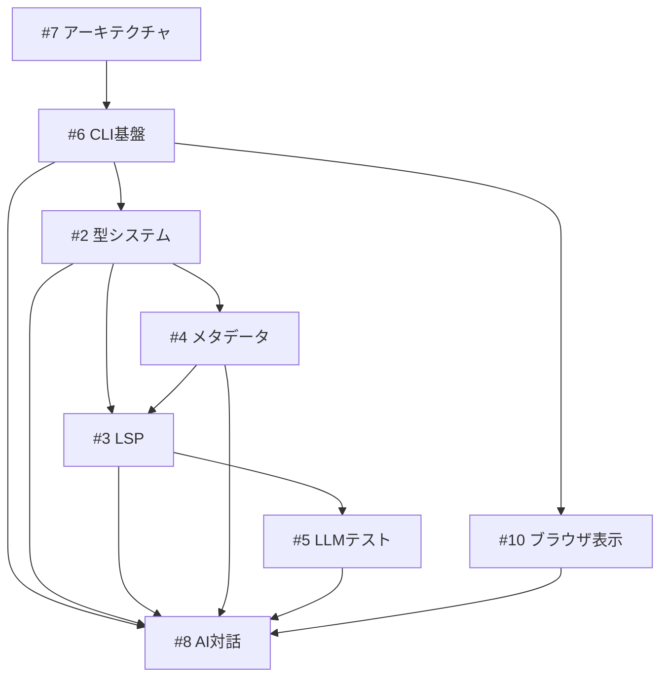

# Implementation Plan from GitHub Issues

- Exported: 2025-10-22 08:47:36Z
- Source: gh issue list --state all

## #1 プロジェクトディレクトリ生成機能の実装

- 状態: CLOSED
- 最終更新: 2025-06-15T07:43:51Z
- 担当: Unassigned
- ラベル: None
- URL: https://github.com/nekowasabi/street-storyteller/issues/1

## 概要

storytelling機能を実装するためのプロジェクトディレクトリ生成機能を追加する。

## 目的

- 新しいストーリープロジェクトを素早く開始できるようにする
- 必要なディレクトリ構造とファイルを自動生成する
- StoryTeller interfaceに基づいた標準的な構造を提供する

## アウトライン

### 1. ディレクトリ構造設計（完全分離型）

```
story-project/
├── src/                 # ストーリー構造定義
│   ├── characters/       # 登場人物定義
│   ├── settings/         # 舞台・設定
│   ├── chapters/         # 章立て構造
│   ├── plots/           # プロット・ストーリーライン
│   ├── timeline/        # 時系列管理
│   ├── themes/          # テーマ定義
│   ├── structure/       # 物語構造
│   └── purpose/         # 目的・表現したいこと
├── manuscripts/         # 実際の原稿ファイル
│   ├── chapter01.md
│   ├── chapter02.md
│   └── ...
├── drafts/             # 下書き・アイデアメモ
│   ├── ideas.md
│   ├── notes.md
│   └── character-sketches.md
├── output/             # AI協業用マークダウン（自動生成）
├── tests/              # ユニットテスト（ストーリー検証）
├── story.ts            # メインストーリーファイル
├── story.config.ts     # 設定ファイル
└── README.md          # プロジェクト説明
```

### 2. 実装要件

- [ ] プロジェクトテンプレート作成
- [ ] ディレクトリ生成コマンド実装
- [ ] 初期ファイル生成（story.ts, story.config.ts）
- [ ] StoryTeller interfaceの実装例を含める
- [ ] 基本的なvalidation設定
- [ ] 各ディレクトリに対応する型定義ファイル生成
- [ ] 現行のユニットテストフレームワーク導入
- [ ] manuscripts/drafts/output の役割分担実装

### 3. 生成されるファイル内容

- **story.ts**: StoryTellerインターフェースの実装
- **story.config.ts**: プロジェクト設定
- **README.md**: プロジェクトの使い方
- **src/**: ストーリー構造定義とサンプルファイル
- **manuscripts/**: 実際の原稿テンプレート
- **drafts/**: 下書き用テンプレート
- **tests/**: ストーリー整合性検証テスト

### 4. コマンドライン実装

```bash
deno run main.ts generate --name "my-story" --template "basic"
```

### 5. テンプレート種類

- `basic`: 基本的なストーリー構造
- `novel`: 小説向け構造
- `screenplay`: 脚本向け構造

### 6. ファイル管理戦略

- **src/**: 構造定義（型安全な設計）
- **manuscripts/**: 実際の文章（人間が執筆）
- **drafts/**: アイデア・メモ（自由形式）
- **output/**: AI協業用（自動生成・コンテキスト提供）

### 7. テスト戦略

- ストーリー要素の整合性検証
- プロットホール防止
- 時系列検証
- キャラクター一貫性チェック

## 技術仕様

- Deno標準ライブラリを使用
- 既存のStoryTeller interfaceに準拠
- TypeScript型安全性を保証
- 物語の各要素を構造化して管理
- Denoテストフレームワーク統合
- 構造定義と実際の文章を完全分離

---

## #2 TypeScript型による物語要素の表現力向上

- 状態: OPEN
- 最終更新: 2025-08-25T12:22:20Z
- 担当: Unassigned
- ラベル: None
- URL: https://github.com/nekowasabi/street-storyteller/issues/2

## 概要

現在の物語要素の型定義を拡張し、TypeScriptの型システムを活用してより表現力豊かで実用的な物語モデリングを実現する。またstorytellerコマンドで要素ごとの型ファイルを生成できるようにする。

長文の詳細情報については **ハイブリッド方式**
を採用し、型安全性と記述の柔軟性を両立する。 さらに、**段階的詳細追加機能**
により既存要素に後から詳細情報を追加できるようにする。

## 現状の課題

1. 現在の型定義は単純な`description: string`のみ
2. キャラクター設定などの長文をTypeScript型で表現するのは不適切
3. 詳細情報の記述方法が標準化されていない
4. 後から詳細情報を追加する機能がない
5. **新規追加: 既存プロジェクトが新機能に対応できない問題**

## 目標

1. TypeScript型システムによる重要メタデータの型安全性確保
2. 長文詳細情報の柔軟な記述方法提供（インライン/ファイル分離選択可能）
3. storytellerコマンドによる要素別型ファイル生成機能の追加
4. **既存要素への段階的詳細追加機能**
5. **新規追加: 既存プロジェクトの継続的アップデート機能**

## アウトライン

### 1. ハイブリッド方式の型設計

#### 基本原則

- **型定義**: 重要なメタデータ（名前、役割、関係性等）
- **詳細情報**: 短文はインライン、長文はMarkdownファイル分離
- **段階的詳細化**: 最初は簡潔に、必要に応じて詳細追加
- **非破壊的拡張**: 既存要素を壊さずに詳細情報追加

#### Character型の拡張（ハイブリッド方式）

```typescript
export type Character = {
  // 必須メタデータ（型安全性重視）
  name: string;
  role: "protagonist" | "antagonist" | "supporting" | "guest";
  traits: string[];
  relationships: {
    [characterName: string]: "ally" | "enemy" | "neutral" | "romantic";
  };
  appearingChapters: string[];

  // 必須概要（短文）
  summary: string; // 1-2行でキャラクターを説明

  // オプショナルな詳細情報（ハイブリッド）
  details?: {
    appearance?: string | { file: string };
    personality?: string | { file: string };
    backstory?: string | { file: string };
    relationships_detail?: string | { file: string };
    goals?: string | { file: string };
    development?: CharacterDevelopment;
  };
};

export type CharacterDevelopment = {
  initial: string;
  goal: string;
  obstacle: string;
  resolution?: string;
  arc_notes?: string | { file: string };
};
```

### 2. 段階的詳細追加機能

#### 詳細追加のワークフロー

**Step 1: 基本キャラクター作成**

```bash
storyteller element character --name "hero" --role "protagonist" --summary "正義感の強い青年"
```

生成される: `src/characters/hero.ts`

```typescript
export const hero: Character = {
  name: "hero",
  role: "protagonist",
  traits: ["brave", "kind"],
  relationships: {},
  appearingChapters: [],
  summary: "正義感の強い青年",
  // details は未定義
};
```

**Step 2: 詳細情報スケルトン追加**

```bash
storyteller element character --name "hero" --with-details
```

自動的に `hero.ts` が更新される:

```typescript
export const hero: Character = {
  name: "hero",
  role: "protagonist",
  traits: ["brave", "kind"],
  relationships: {},
  appearingChapters: [],
  summary: "正義感の強い青年",

  // 自動追加される詳細情報スケルトン
  details: {
    appearance: "TODO: 外見の説明を記述",
    personality: "TODO: 性格の説明を記述",
    backstory: "TODO: バックストーリーを記述",
    development: {
      initial: "TODO: 初期状態",
      goal: "TODO: 目標",
      obstacle: "TODO: 障害",
      resolution: "TODO: 解決",
    },
  },
};
```

**Step 3A: インライン詳細記述**

```typescript
// 手動編集でインライン詳細を記述
export const hero: Character = {
  // ...基本情報
  details: {
    appearance: "身長175cm、黒髪に深い茶色の瞳。騎士の訓練で鍛えられた体格。",
    personality: "内向的だが正義感が強く、困っている人を見過ごせない性格。",
    backstory: "TODO: バックストーリーを記述", // 後で詳細化
    development: {
      initial: "自信のない見習い騎士",
      goal: "真の騎士として人々を守る",
      obstacle: "過去のトラウマと自己不信",
      resolution: "TODO: 解決",
    },
  },
};
```

**Step 3B: ファイル分離への変換**

```bash
storyteller element character --name "hero" --separate-files backstory,development
```

自動的に以下が実行される:

1. Markdownファイル生成
2. `hero.ts`のファイル参照への更新

生成されるファイル:

```
src/characters/
├── hero.ts
└── details/
    ├── hero-backstory.md
    └── hero-development.md
```

更新される `hero.ts`:

```typescript
export const hero: Character = {
  // ...基本情報
  details: {
    appearance: "身長175cm、黒髪に深い茶色の瞳。", // インラインのまま
    personality: "内向的だが正義感が強く...", // インラインのまま
    backstory: { file: "characters/details/hero-backstory.md" }, // ファイル分離
    development: {
      initial: "自信のない見習い騎士",
      goal: "真の騎士として人々を守る",
      obstacle: "過去のトラウマと自己不信",
      resolution: "TODO: 解決",
      arc_notes: { file: "characters/details/hero-development.md" }, // ファイル分離
    },
  },
};
```

### 3. storytellerコマンド拡張

#### 基本コマンド

```bash
# 新規キャラクター作成（基本情報のみ）
storyteller element character --name "hero" --role "protagonist" --summary "概要"

# 新規キャラクター作成（詳細情報付き）
storyteller element character --name "villain" --role "antagonist" --with-details

# 新規キャラクター作成（ファイル分離）
storyteller element character --name "complex" --role "supporting" --with-details --separate-files
```

#### 詳細追加コマンド

```bash
# 既存キャラクターに詳細情報スケルトン追加
storyteller element character --name "hero" --with-details

# 特定の詳細項目のみ追加
storyteller element character --name "hero" --add-details "backstory,development"

# 既存詳細をファイル分離に変換
storyteller element character --name "hero" --separate-files "backstory,personality"

# すべての詳細をファイル分離に変換
storyteller element character --name "hero" --separate-files all
```

#### インテリジェントな動作

```bash
# 既存要素の検出と適切な動作
storyteller element character --name "existing-hero" --with-details
```

動作パターン:

1. **要素が存在しない** → 新規作成（詳細付き）
2. **要素が存在、details未定義** → detailsスケルトン追加
3. **要素が存在、details定義済み** → 不足項目のみ追加
4. **要素が存在、すべて定義済み** → 警告表示、`--force`で上書き

### 4. プロジェクト更新メカニズム（新規追加）

#### storyteller updateコマンド

既存プロジェクトを最新のstreet-storytellerバージョンに対応させる機能：

```bash
# プロジェクトのstreet-storytellerバージョンを確認
storyteller version --check

# 利用可能な更新を確認
storyteller update --check

# プロジェクトを最新バージョンに更新
storyteller update --apply

# 特定バージョンへの更新
storyteller update --to v2.0.0

# 更新内容のプレビュー（実際には変更しない）
storyteller update --dry-run

# 新しい型定義のみ更新
storyteller update --types-only

# 新機能を選択的に追加
storyteller update --add-feature character_details
storyteller update --add-feature lsp_support
```

#### プロジェクトメタデータ管理

`.storyteller/config.json`でプロジェクト情報を管理：

```json
{
  "version": "1.0.0",
  "created": "2024-01-15",
  "template": "novel",
  "features": {
    "character_details": true,
    "lsp_support": false,
    "term_management": true
  },
  "compatibility": "strict"
}
```

### 5. バージョン移行システム（新規追加）

#### 自動マイグレーション

v1からv2への移行を支援する自動化システム：

```bash
# インタラクティブな移行ウィザード
storyteller migrate

🔄 Street Storyteller Migration Wizard
━━━━━━━━━━━━━━━━━━━━━━━━━━━━━━━━━━━

Current version: 1.0.0
Available update: 2.0.0

📋 Migration Analysis:
  ✓ 12 character files will be updated
  ✓ 3 new type definitions will be added
  ⚠ 2 breaking changes require your attention

Choose migration strategy:
1. [Automatic] Apply all changes with defaults
2. [Interactive] Review each change
3. [Dry-run] Show what would change
4. [Cancel] Exit without changes
```

#### マイグレーションスクリプト

```typescript
// migrations/1.0.0-to-2.0.0.ts
export interface Migration {
  from: string;
  to: string;
  description: string;
  breaking: boolean;

  canMigrate(project: Project): MigrationCheck;
  migrate(project: Project): MigrationResult;
  rollback(backup: Backup): void;
}
```

#### Git統合移行

```bash
# Gitと連携した安全な移行
storyteller migrate --git-safe

✓ Creating migration branch: migrate-to-v2
✓ Will create separate commits for each step

Migration Steps:
1. Update type definitions (commit)
2. Migrate character files (commit)  
3. Update imports (commit)
4. Add new features (commit)
```

#### 移行状態の追跡

`.storyteller/migration-status.json`で進捗管理：

```json
{
  "originalVersion": "1.0.0",
  "targetVersion": "2.0.0",
  "status": "partial",
  "progress": {
    "total": 15,
    "completed": 12,
    "skipped": 2,
    "failed": 1
  },
  "completedFiles": [...],
  "pendingFiles": [...],
  "issues": [...]
}
```

### 6. アーキテクチャ設計指針（新規追加）

#### プラグインベースアーキテクチャ

既存プロジェクトへの影響を最小化する設計：

```typescript
// core/storyteller.ts - 最小限のコアインターフェース
export interface StoryTellerCore {
  version: string;
  validate(): ValidationResult;
  output(): string;
}

// plugins/character-details/index.ts - 追加機能はプラグインとして
export interface CharacterDetailsPlugin {
  addDetails(character: Character): CharacterWithDetails;
  validateDetails(): ValidationResult;
}
```

#### スキーマバージョニング

複数バージョンの共存：

```typescript
// types/v1/character.ts
export namespace V1 {
  export type Character = {
    name: string;
    description: string;
  };
}

// types/v2/character.ts
export namespace V2 {
  export type Character = {
    name: string;
    role: "protagonist" | "antagonist";
    summary: string;
    details?: CharacterDetails;
  };
}

// types/compat.ts - 自動変換レイヤー
export function migrateCharacter(char: V1.Character): V2.Character {
  return {
    name: char.name,
    role: "supporting",
    summary: char.description,
  };
}
```

### 7. 実装計画（更新）

#### Phase 1: 基本詳細追加機能

- [ ] 既存要素の検出機能
- [ ] detailsスケルトン追加機能
- [ ] `--with-details`オプション実装
- [ ] TypeScriptファイル更新機能

#### Phase 2: プロジェクト更新機能

- [ ] プロジェクトメタデータ管理
- [ ] `storyteller update`コマンド実装
- [ ] バージョン互換性チェック
- [ ] 選択的機能追加

#### Phase 3: マイグレーションシステム

- [ ] マイグレーションフレームワーク
- [ ] v1→v2移行スクリプト
- [ ] インタラクティブウィザード
- [ ] Git統合とロールバック

#### Phase 4: ファイル分離機能

- [ ] `--separate-files`オプション実装
- [ ] インライン→ファイル参照変換機能
- [ ] Markdownテンプレート生成
- [ ] ファイル参照整合性チェック

#### Phase 5: 高度な管理機能

- [ ] 詳細完成度レポート機能
- [ ] `--add-details`特定項目追加
- [ ] `--force`上書き機能
- [ ] 一括詳細追加機能

### 8. 使用例ワークフロー（既存プロジェクトの更新）

```bash
# 1. 既存v1プロジェクトの確認
cd my-existing-story
storyteller version --check
# Output: Current: v1.0.0, Latest: v2.0.0

# 2. 更新内容の確認
storyteller update --check
# Shows available features and changes

# 3. バックアップ付き移行
storyteller migrate --git-safe

# 4. 新機能の選択的追加
storyteller update --add-feature character_details

# 5. 既存キャラクターに詳細追加
storyteller element character --name "existing-hero" --with-details

# 6. 完成度チェック
storyteller validate --completeness-report
```

## 期待される効果

- **段階的開発**: 最低限から始めて段階的に詳細化
- **非破壊的拡張**: 既存作業を無駄にしない追加機能
- **柔軟な選択**: インライン/ファイル分離の後からの変更
- **進捗管理**: 詳細情報の完成度を可視化
- **チーム開発**: 分担作業とレビューの効率化
- **保守性**: 大規模プロジェクトでの管理性向上
- **継続的アップデート**: 既存プロジェクトも新機能を享受

## 技術要件

- TypeScript AST解析・編集機能
- Markdownテンプレート生成
- ファイル参照整合性管理
- 段階的ファイル更新機能
- バックアップ・ロールバック機能
- **新規追加: マイグレーションフレームワーク**
- **新規追加: バージョン互換性管理**
- **新規追加: プラグインシステム**

---

## #3 LSP統合による原稿チェック機能の実装

- 状態: OPEN
- 最終更新: 2025-06-16T08:06:56Z
- 担当: Unassigned
- ラベル: None
- URL: https://github.com/nekowasabi/street-storyteller/issues/3

## 概要

storytellerコマンドにLanguage Server Protocol (LSP)
統合による原稿チェック機能を追加し、リアルタイムで物語要素の整合性を検証できるようにする。neovimとVSCodeでの利用を想定し、最大限の拡張性を提供する。

**重要機能**: 日本語執筆に配慮した @なしキャラクター検出とコードジャンプ機能

## 現状の課題

1. 原稿とキャラクター定義の整合性チェック機能がない
2. 手動での検証に頼っており、見落としが発生しやすい
3. エディタでのリアルタイム支援機能がない
4. 物語要素間の関係性を自動検証する仕組みがない
5. 原稿から型定義へのナビゲーション機能がない
6. **@記法が日本語執筆には不自然で書きづらい**

## 目標

1. **LSP統合**: リアルタイムな原稿検証機能
2. **storytellerコマンド拡張**: `storyteller lsp`サブコマンド追加
3. **エディタ統合**: neovim/VSCode での自動設定機能
4. **段階的利用**: ワンショット検証からリアルタイム支援まで
5. **自然なコードジャンプ**: @なしでのキャラクター・設定定義へのジャンプ
6. **日本語最適化**: 自然な日本語執筆スタイルの維持

## アウトライン

### 1. storytellerコマンド拡張

#### 新しい`lsp`サブコマンド

```bash
# LSPサーバー起動
storyteller lsp start --stdio      # neovim/VSCode用
storyteller lsp start --daemon     # デーモンモード

# ワンショット検証
storyteller lsp validate manuscripts/chapter01.md
storyteller lsp validate manuscripts/ --recursive

# ファイル監視
storyteller lsp watch manuscripts/

# エディタ設定自動生成
storyteller lsp install nvim
storyteller lsp install vscode

# ヘルプ
storyteller lsp help
```

#### コマンドオプション

```bash
# 基本オプション
--stdio              stdio モード（LSP標準）
--daemon             デーモンモード
--port <number>      デーモンポート（デフォルト: 7007）
--recursive, -r      再帰的ファイル検索
--watch, -w          ファイル監視モード

# 検証オプション
--check-characters   キャラクター整合性チェック
--check-settings     設定整合性チェック
--check-plots        プロット整合性チェック
--check-timeline     時系列整合性チェック
--strict             厳密モード（警告もエラー扱い）

# 検出オプション ← NEW
--detection-mode <mode>     検出モード (auto/explicit/contextual)
--confidence-threshold <n>  信頼度閾値 (0.0-1.0, デフォルト: 0.6)
--enable-implicit           暗示的キャラクター検出有効化

# 出力オプション
--format json        JSON形式出力
--format plain       プレーンテキスト出力
--quiet, -q          エラーのみ出力
--verbose, -v        詳細出力
```

### 2. LSPサーバー実装

#### 基本アーキテクチャ

```typescript
// src/lsp/server.ts
export class StorytellerLanguageServer {
  // LSP標準機能
  - initialize()                    // サーバー初期化
  - textDocument/didOpen            // ファイルオープン時
  - textDocument/didChange          // ファイル変更時
  - textDocument/diagnostic         // 診断実行
  - textDocument/completion         // 補完機能
  - textDocument/hover              // ホバー情報
  - textDocument/definition         // 定義ジャンプ
  - textDocument/references         // 参照検索
  - textDocument/typeDefinition     // 型定義ジャンプ
  
  // Storyteller独自機能
  - validateStoryProject()          // プロジェクト全体検証
  - loadCharacterTypes()            // キャラクター型読み込み
  - validateConsistency()           // 整合性チェック
  - resolveStoryElementReference()  // 物語要素参照解決
  - detectImplicitCharacters()      // 暗示的キャラクター検出 ← NEW
}
```

### 3. 自然言語キャラクター検出機能

#### Character型の拡張（@なし検出対応）

```typescript
// src/type/character.ts（拡張版）
export type Character = {
  name: string; // 内部ID名
  displayNames?: string[]; // 表示名の配列（原稿で使用される名前）
  aliases?: string[]; // 別名・愛称の配列
  pronouns?: string[]; // 代名詞（彼、彼女、それ等）

  // 検出ヒント ← NEW
  detectionHints?: {
    commonPatterns: string[]; // よく使われる文脈パターン
    excludePatterns: string[]; // 除外すべき文脈
    requiresContext: boolean; // 文脈必須フラグ
    confidence: number; // ベース信頼度
  };

  // 既存のプロパティ
  role: "protagonist" | "antagonist" | "supporting" | "guest";
  traits: string[];
  relationships: { [characterName: string]: RelationType };
  appearingChapters: string[];
  summary: string;
  details?: CharacterDetails;
};

// 使用例
export const hero: Character = {
  name: "hero",
  displayNames: ["勇者", "英雄", "ヒーロー"],
  aliases: ["勇", "主人公"],
  pronouns: ["彼"],

  detectionHints: {
    commonPatterns: [
      "勇者は",
      "勇者が",
      "勇者の",
      "「.*」と勇者",
      "勇者を見て",
      "勇者に向かって",
    ],
    excludePatterns: [
      "勇者という存在",
      "勇者とは何か", // 概念的な使用は除外
      "勇者のような", // 比喩表現は除外
    ],
    requiresContext: false, // 「勇者」は文脈なしでも検出OK
    confidence: 0.9,
  },

  role: "protagonist",
  summary: "正義感の強い青年騎士",
  // ...
};
```

#### 段階的検出ロジック

```typescript
// src/lsp/character-detection.ts
export class CharacterDetectionEngine {
  async detectCharacterReference(
    word: string,
    position: Position,
    document: string,
  ): Promise<CharacterReference | null> {
    // 1. 明示的参照（最高優先度 - 信頼度: 1.0）
    if (word.startsWith("@")) {
      return this.handleExplicitReference(word.slice(1));
    }

    // 2. 完全一致（高優先度 - 信頼度: 0.95）
    const exactMatch = await this.findExactCharacterMatch(word);
    if (exactMatch) {
      return {
        character: exactMatch,
        confidence: 0.95,
        detectionMethod: "exact",
      };
    }

    // 3. 表示名マッチ（中高優先度 - 信頼度: 0.8-0.9）
    const displayMatch = await this.findDisplayNameMatch(word);
    if (displayMatch) {
      const contextConfidence = await this.calculateContextualConfidence(
        word,
        position,
        document,
        displayMatch,
      );
      return {
        character: displayMatch,
        confidence: Math.min(0.9, contextConfidence + 0.3),
        detectionMethod: "display_name",
      };
    }

    // 4. 別名マッチ（中優先度 - 信頼度: 0.7-0.8）
    const aliasMatch = await this.findAliasMatch(word);
    if (aliasMatch) {
      const contextConfidence = await this.calculateContextualConfidence(
        word,
        position,
        document,
        aliasMatch,
      );
      return {
        character: aliasMatch,
        confidence: Math.min(0.8, contextConfidence + 0.2),
        detectionMethod: "alias",
      };
    }

    // 5. 文脈推定（低優先度 - 信頼度: 0.5-0.7）
    const contextMatch = await this.detectByContext(word, position, document);
    if (contextMatch && contextMatch.confidence > 0.6) {
      return contextMatch;
    }

    return null;
  }

  // 文脈による信頼度計算
  private async calculateContextualConfidence(
    word: string,
    position: Position,
    document: string,
    character: Character,
  ): Promise<number> {
    const line = this.getLineAt(document, position.line);
    const sentence = this.getSentenceContaining(document, position);
    const paragraph = this.getParagraphContaining(document, position);

    let confidence = character.detectionHints?.confidence || 0.5;

    // 文法パターンによるスコア加算
    if (this.matchesGrammaticalPattern(word, line)) {
      confidence += 0.2;
    }

    // 共通パターンマッチング
    const patterns = character.detectionHints?.commonPatterns || [];
    const matchedPatterns = patterns.filter((pattern) =>
      new RegExp(pattern).test(sentence)
    );
    confidence += matchedPatterns.length * 0.1;

    // 除外パターンチェック
    const excludePatterns = character.detectionHints?.excludePatterns || [];
    const hasExcludePattern = excludePatterns.some((pattern) =>
      new RegExp(pattern).test(sentence)
    );
    if (hasExcludePattern) {
      confidence -= 0.3;
    }

    // 段落内での頻度
    const frequency = this.calculateWordFrequency(word, paragraph);
    confidence += Math.min(0.1, frequency * 0.05);

    // 近接するキャラクター参照
    const nearbyCharacters = this.findNearbyCharacterReferences(
      position,
      document,
    );
    if (nearbyCharacters.includes(character.name)) {
      confidence += 0.15;
    }

    return Math.min(1.0, Math.max(0.0, confidence));
  }

  // 文法パターン検出
  private matchesGrammaticalPattern(word: string, line: string): boolean {
    const patterns = [
      new RegExp(`${word}は`), // 勇者は
      new RegExp(`${word}が`), // 勇者が
      new RegExp(`${word}を`), // 勇者を
      new RegExp(`${word}に`), // 勇者に
      new RegExp(`${word}の`), // 勇者の
      new RegExp(`「[^」]*」と${word}`), // 「」と勇者
      new RegExp(`${word}[^。]*?(言った|答えた|考えた|思った)`), // 勇者は答えた
      new RegExp(`${word}[^。]*?(立ち上がった|歩いた|振り返った)`), // 勇者が立ち上がった
    ];

    return patterns.some((pattern) => pattern.test(line));
  }
}
```

#### 検出可能な参照パターン（@なし対応）

```markdown
<\!-- 1. 明示的参照（100%信頼度） --> @勇者が立ち上がった。 →
src/characters/hero.ts (confidence: 1.0) @魔王の計画が明らかになる。 →
src/characters/demon_lord.ts (confidence: 1.0)

<\!-- 2. 自然な日本語表現（高信頼度） --> 勇者は剣を抜いた。 →
src/characters/hero.ts (confidence: 0.95) 「待て」と魔王が声をかけた。 →
src/characters/demon_lord.ts (confidence: 0.92) アリスの目に涙が浮かんだ。 →
src/characters/alice.ts (confidence: 0.88)

<\!-- 3. 別名・愛称（中信頼度） --> 勇が振り返った。 → src/characters/hero.ts
(confidence: 0.75) 師匠は微笑んだ。 → src/characters/wise_wizard.ts (confidence:
0.72)

<\!-- 4. 代名詞（文脈依存） --> 彼は立ち上がった。 →
直前の文脈からキャラクター推定 (confidence: 0.65)

<\!-- 5. ファイルパス参照 --> 詳細は [こちら](src/characters/hero.ts) を参照。 →
src/characters/hero.ts 設定は [背景設定](characters/details/hero-backstory.md)
にある。 → characters/details/hero-backstory.md

<\!-- 6. 設定参照（#なし対応） --> 王都の城門前で待ち合わせた。 →
src/settings/royal_capital.ts (confidence: 0.85) 魔法の森で迷子になった。 →
src/settings/magic_forest.ts (confidence: 0.78) #王都の人口は50万人である。 →
src/settings/royal_capital.ts (confidence: 1.0)
```

### 4. コードジャンプ・ナビゲーション機能

#### Definition Provider実装（@なし対応）

```typescript
// src/lsp/definition-provider.ts（@なし対応版）
export class DefinitionProvider {
  async findDefinitions(
    word: string,
    position: Position,
    document: string,
  ): Promise<Location[]> {
    const definitions: Location[] = [];

    // 1. キャラクター検出（@なし対応）
    const characterRef = await this.characterDetection.detectCharacterReference(
      word,
      position,
      document,
    );

    if (characterRef && characterRef.confidence > 0.6) {
      const location = await this.getCharacterDefinitionLocation(
        characterRef.character,
      );
      if (location) {
        definitions.push({
          ...location,
          // 信頼度情報を付与
          data: {
            confidence: characterRef.confidence,
            detectionMethod: characterRef.detectionMethod,
            suggestion: characterRef.confidence < 0.8
              ? `Consider using @${characterRef.character.name} for explicit reference`
              : null,
          },
        });
      }
    }

    // 2. 設定検出（#なし対応）
    const settingRef = await this.detectSettingReference(
      word,
      position,
      document,
    );
    if (settingRef && settingRef.confidence > 0.6) {
      definitions.push(settingRef);
    }

    // 3. ファイル参照検出
    const fileRef = await this.detectFileReference(word, position, document);
    if (fileRef) {
      definitions.push(fileRef);
    }

    return definitions;
  }
}
```

#### 曖昧性の診断・警告システム

```typescript
// src/lsp/ambiguity-diagnostics.ts
export class AmbiguityDiagnostics {
  
  createCharacterAmbiguityDiagnostic(
    word: string,
    matches: CharacterReference[],
    position: Position
  ): Diagnostic[] {
    const diagnostics: Diagnostic[] = [];
    
    if (matches.length > 1) {
      // 複数候補がある場合
      diagnostics.push({
        range: { 
          start: position, 
          end: { line: position.line, character: position.character + word.length }
        },
        severity: DiagnosticSeverity.Information,
        message: `"${word}" could refer to multiple characters. Most likely: ${matches[0].character.name}`,
        source: "storyteller",
        code: "ambiguous-character-reference",
        relatedInformation: matches.map(match => ({
          location: { uri: this.getCharacterDefinitionUri(match.character), range: {...} },
          message: `${match.character.name}: ${match.character.summary} (confidence: ${Math.round(match.confidence * 100)}%)`
        })),
        data: {
          quickFix: {
            title: `Use @${matches[0].character.name} for explicit reference`,
            edit: {
              range: { start: position, end: { line: position.line, character: position.character + word.length }},
              newText: `@${matches[0].character.name}`
            }
          }
        }
      });
    }
    
    if (matches.length === 1 && matches[0].confidence < 0.8) {
      // 信頼度が低い場合
      diagnostics.push({
        range: { 
          start: position, 
          end: { line: position.line, character: position.character + word.length }
        },
        severity: DiagnosticSeverity.Hint,
        message: `Uncertain character reference "${word}" (${Math.round(matches[0].confidence * 100)}% confidence). Use @${matches[0].character.name} for clarity.`,
        source: "storyteller",
        code: "uncertain-character-reference",
        data: {
          quickFix: {
            title: `Use @${matches[0].character.name} for explicit reference`,
            edit: {
              range: { start: position, end: { line: position.line, character: position.character + word.length }},
              newText: `@${matches[0].character.name}`
            }
          }
        }
      });
    }
    
    return diagnostics;
  }
}
```

### 5. 検証機能

#### キャラクター整合性チェック（@なし対応）

```typescript
// 検証項目
1. 未定義キャラクター参照
   - 明示的参照（@キャラクター名）の存在確認
   - 暗示的参照（勇者、アリス等）の信頼度チェック
   - 低信頼度参照の警告

2. キャラクター登場章整合性
   - 定義された登場章に原稿が存在するか
   - 登場しない章で名前が出現していないか（信頼度考慮）

3. キャラクター性格一貫性
   - 定義された性格・特性との矛盾チェック
   - 関係性設定との整合性確認

4. 台詞・行動の一貫性
   - キャラクターの口調パターン
   - 行動傾向との整合性

5. 代名詞解決 ← NEW
   - 「彼」「彼女」等の代名詞が正しいキャラクターを指しているか
   - 文脈による代名詞の曖昧性解決

6. ファイル参照整合性
   - 参照されているファイルが実際に存在するか
   - リンク切れの検出と警告
```

### 6. エディタ統合

#### neovim設定自動生成（@なし対応）

```lua
-- ~/.config/nvim/lua/storyteller-lsp.lua (自動生成)
local M = {}

function M.setup()
  local lspconfig = require('lspconfig')
  local configs = require('lspconfig.configs')
  
  if not configs.storyteller then
    configs.storyteller = {
      default_config = {
        cmd = { 'storyteller', 'lsp', 'start', '--stdio' },
        filetypes = { 'markdown' },
        root_dir = function(fname)
          return lspconfig.util.find_file({'story.config.ts'}, fname) or
                 lspconfig.util.find_git_ancestor(fname)
        end,
        settings = {
          storyteller = {
            validation = {
              checkCharacters = true,
              checkSettings = true,
              checkPlots = true,
              checkTimeline = true,
              checkFileReferences = true
            },
            detection = {  -- NEW
              enableImplicit = true,        -- @なし検出有効
              confidenceThreshold = 0.6,    -- 信頼度閾値
              mode = "auto"                 -- auto/explicit/contextual
            }
          }
        }
      }
    }
  end
  
  lspconfig.storyteller.setup({
    on_attach = function(client, bufnr)
      local opts = { noremap=true, silent=true, buffer=bufnr }
      
      -- 基本LSP機能
      vim.keymap.set('n', '<leader>sd', vim.lsp.buf.show_line_diagnostics, opts)
      
      -- コードナビゲーション（@なし対応）
      vim.keymap.set('n', 'gd', function()
        -- カーソル下の単語でジャンプ（@なしでも動作）
        vim.lsp.buf.definition()
      end, opts)
      vim.keymap.set('n', 'gD', vim.lsp.buf.type_definition, opts)
      vim.keymap.set('n', 'gr', vim.lsp.buf.references, opts)
      
      -- ホバー情報（信頼度表示付き）
      vim.keymap.set('n', 'K', function()
        vim.lsp.buf.hover()
      end, opts)
      
      -- 明示的参照への変換 ← NEW
      vim.keymap.set('n', '<leader>@', function()
        -- カーソル下の単語を @付きに変換
        local word = vim.fn.expand('<cword>')
        vim.lsp.buf.code_action({
          filter = function(action)
            return action.title:match("Use @.* for explicit reference")
          end,
          apply = true
        })
      end, opts)
      
      -- 信頼度レポート
      vim.keymap.set('n', '<leader>sr', function()
        vim.cmd('\!storyteller lsp validate % --verbose --confidence-threshold 0.8')
      end, opts)
    end,
    
    -- 原稿ファイルのみで有効化
    autostart = function(bufnr)
      local filename = vim.api.nvim_buf_get_name(bufnr)
      return filename:match('manuscripts/.*%.md$') or 
             filename:match('%.manuscript%.md$')
    end
  })
end

return M
```

### 7. 補完・支援機能

#### 文脈を考慮した補完（@なし対応）

```typescript
// 補完機能の拡張
export class CompletionProvider {
  async getCompletions(
    position: Position,
    document: string,
  ): Promise<CompletionItem[]> {
    const items: CompletionItem[] = [];
    const line = this.getLineAt(document, position.line);
    const currentWord = this.getWordAtPosition(line, position.character);

    // 1. 明示的参照補完（@で始まる場合）
    if (currentWord.startsWith("@")) {
      items.push(
        ...await this.getExplicitCharacterCompletions(currentWord.slice(1)),
      );
    } // 2. 文脈による暗示的補完（@なし）
    else if (this.isCharacterContext(line, position)) {
      items.push(
        ...await this.getImplicitCharacterCompletions(currentWord, line),
      );
    }

    // 3. 設定名補完
    if (currentWord.startsWith("#") || this.isSettingContext(line, position)) {
      items.push(...await this.getSettingCompletions(currentWord));
    }

    return items;
  }

  // 文脈によるキャラクター補完
  private async getImplicitCharacterCompletions(
    partialWord: string,
    line: string,
  ): Promise<CompletionItem[]> {
    const characters = await this.loadCharacters();
    const completions: CompletionItem[] = [];

    for (const character of characters) {
      // 表示名での補完
      const matchingDisplayNames = character.displayNames?.filter((name) =>
        name.startsWith(partialWord)
      ) || [];

      for (const displayName of matchingDisplayNames) {
        const confidence = this.estimateCompletionConfidence(
          displayName,
          line,
          character,
        );

        completions.push({
          label: displayName,
          kind: CompletionItemKind.Reference,
          detail: `${character.summary} (confidence: ${
            Math.round(confidence * 100)
          }%)`,
          documentation: this.createCharacterDocumentation(character),
          insertText: displayName,
          sortText: `${1.0 - confidence}${displayName}`, // 信頼度順でソート
          data: {
            characterName: character.name,
            confidence,
            suggestion: confidence < 0.8
              ? `Consider using @${character.name} for explicit reference`
              : null,
          },
        });
      }
    }

    return completions.sort((a, b) => b.data.confidence - a.data.confidence);
  }
}
```

#### ホバー情報（信頼度表示付き）

```typescript
// ホバー情報の拡張
export class HoverProvider {
  async getHover(position: Position, document: string): Promise<Hover | null> {
    const word = this.getWordAtPosition(document, position);
    const characterRef = await this.detectCharacterReference(
      word,
      position,
      document,
    );

    if (characterRef) {
      const contents = [
        `## ${
          characterRef.character.displayNames?.[0] ||
          characterRef.character.name
        }`,
        `**内部名**: ${characterRef.character.name}`,
        `**役割**: ${characterRef.character.role}`,
        `**概要**: ${characterRef.character.summary}`,
        "",
        `**検出信頼度**: ${Math.round(characterRef.confidence * 100)}%`,
        `**検出方法**: ${
          this.getDetectionMethodDescription(characterRef.detectionMethod)
        }`,
        "",
      ];

      // 信頼度に応じた追加情報
      if (characterRef.confidence < 0.8) {
        contents.push(
          `💡 **ヒント**: より明確にするには \`@${characterRef.character.name}\` を使用`,
        );
        contents.push("");
      }

      if (characterRef.character.traits?.length > 0) {
        contents.push(`**特性**: ${characterRef.character.traits.join(", ")}`);
      }

      if (characterRef.character.appearingChapters?.length > 0) {
        contents.push(
          `**登場章**: ${characterRef.character.appearingChapters.join(", ")}`,
        );
      }

      contents.push("");
      contents.push(
        `[定義を見る](src/characters/${characterRef.character.name}.ts)`,
      );

      if (characterRef.character.details?.backstory) {
        const backstoryRef =
          typeof characterRef.character.details.backstory === "string"
            ? null
            : characterRef.character.details.backstory.file;
        if (backstoryRef) {
          contents.push(`[詳細設定](${backstoryRef})`);
        }
      }

      return {
        contents: contents.join("\n"),
      };
    }

    return null;
  }
}
```

### 8. 実装計画

#### Phase 1: 基本LSP機能

- [ ] JSON-RPC over stdio プロトコル実装
- [ ] LSPサーバーの基本メッセージハンドリング
- [ ] `storyteller lsp start --stdio` コマンド実装
- [ ] プロジェクト検出機能（story.config.ts 検索）
- [ ] キャラクター定義ファイル読み込み
- [ ] 基本的なキャラクター名チェック（@付き参照）
- [ ] neovim設定自動生成機能
- [ ] 簡単な診断表示（エラー・警告）

#### Phase 2: @なしキャラクター検出機能 ← NEW

- [ ] **Character型の拡張**
  - [ ] displayNames, aliases, pronouns フィールド追加
  - [ ] detectionHints設定追加
  - [ ] 信頼度システム実装
- [ ] **暗示的キャラクター検出エンジン**
  - [ ] 段階的検出ロジック実装（明示的→完全一致→表示名→別名→文脈）
  - [ ] 文法パターン検出（「は」「が」「を」等の助詞）
  - [ ] 文脈解析による信頼度計算
  - [ ] 除外パターン処理（概念的使用の除外）
- [ ] **曖昧性処理システム**
  - [ ] 複数候補の信頼度順ソート
  - [ ] 曖昧性警告の生成
  - [ ] Quick Fix機能（@付き変換提案）
- [ ] **代名詞解決機能**
  - [ ] 「彼」「彼女」等の代名詞検出
  - [ ] 文脈による参照先キャラクター推定

#### Phase 3: ナビゲーション機能（@なし対応）

- [ ] **Definition Provider実装（@なし対応）**
  - [ ] `textDocument/definition` メッセージハンドリング
  - [ ] 暗示的キャラクター名 → 型定義ファイルジャンプ
  - [ ] 設定名（#なし） → 設定定義ファイルジャンプ
  - [ ] ファイルパス → 実際のファイルジャンプ
  - [ ] 信頼度に基づくジャンプ判定
- [ ] **References Provider実装（@なし対応）**
  - [ ] `textDocument/references` メッセージハンドリング
  - [ ] キャラクター定義 → 原稿使用箇所検索（暗示的参照含む）
  - [ ] 信頼度フィルタリング機能
- [ ] **補完機能拡張（@なし対応）**
  - [ ] 文脈を考慮した暗示的補完
  - [ ] 信頼度付き補完候補表示
  - [ ] 明示的参照への変換提案

#### Phase 4: 検証機能強化（@なし対応）

- [ ] **キャラクター整合性チェック拡張**
  - [ ] 暗示的参照の信頼度チェック
  - [ ] 低信頼度参照の警告
  - [ ] 代名詞解決の整合性チェック
- [ ] **設定・世界観チェック**
  - [ ] #なし設定参照の検出
  - [ ] 地理的整合性チェック
  - [ ] 時系列整合性チェック
- [ ] **`storyteller lsp validate` コマンド拡張**
  - [ ] `--confidence-threshold` オプション
  - [ ] `--detection-mode` オプション
  - [ ] `--enable-implicit` オプション
- [ ] **ファイル監視機能**

#### Phase 5: 高度な支援機能

- [ ] **ホバー情報表示（信頼度付き）**
  - [ ] `textDocument/hover` メッセージハンドリング
  - [ ] 信頼度情報の表示
  - [ ] 検出方法の説明
  - [ ] 明示的参照への変換提案
- [ ] **Code Action機能**
  - [ ] 暗示的参照 → 明示的参照変換
  - [ ] 曖昧性解決支援
  - [ ] 信頼度向上提案
- [ ] **VSCode拡張対応**
- [ ] **診断機能詳細化**

#### Phase 6: AI統合・高度分析

- [ ] **LLMによる文脈解析**
- [ ] **キャラクター行動一貫性AI分析**
- [ ] **自動修正提案**

### 9. 使用例ワークフロー

#### 自然な日本語執筆スタイル ← NEW

```markdown
<\!-- manuscripts/chapter01.md -->

# 第1章：出会い

勇者は小さな村を歩いていた。 ↑ gd でジャンプ → src/characters/hero.ts
(confidence: 95%) ↑ K でホバー → "勇者 (検出信頼度: 95%、検出方法:
display_name)"

「こんにちは」と村人が声をかけた。 ↑ gd でジャンプ → src/characters/villager.ts
(confidence: 88%)

賢者の元を訪れることにした。 ↑ gd でジャンプ → src/characters/wise_wizard.ts
(confidence: 72%) ↑ ヒント表示: "Consider using @wise_wizard for explicit
reference"

アリスは魔法の森で迷子になった。 ↑ gd でジャンプ → src/characters/alice.ts
(confidence: 92%) ↑ gd でジャンプ → src/settings/magic_forest.ts (confidence:
85%)

彼は立ち上がった。 ↑ gd でジャンプ → 文脈から推定されたキャラクター (confidence:
65%)

@勇者は剣を抜いた。\
↑ gd でジャンプ → src/characters/hero.ts (confidence: 100%) ← 明示的参照
```

#### 段階的精度向上ワークフロー

```bash
# 1. 自然な日本語で執筆
nvim manuscripts/chapter01.md
# 「勇者は立ち上がった」と記述

# 2. 信頼度確認
# K (hover) → "勇者 (confidence: 95%)"
# 十分な信頼度なのでそのまま

# 3. 曖昧な場合の対処
# 「賢者は答えた」と記述
# K (hover) → "賢者 (confidence: 72%) - Consider using @wise_wizard"
# <leader>@ → 自動的に @wise_wizard に変換

# 4. 信頼度レポート確認
# <leader>sr → 信頼度が低い参照の一覧表示
```

## TODO項目

### Phase 1: 基本LSP機能

- [ ] JSON-RPC over stdio プロトコル実装
- [ ] LSPサーバーの基本メッセージハンドリング
- [ ] `storyteller lsp start --stdio` コマンド実装
- [ ] プロジェクト検出機能（story.config.ts 検索）
- [ ] キャラクター定義ファイル読み込み
- [ ] 基本的なキャラクター名チェック（@付き参照）
- [ ] neovim設定自動生成機能
- [ ] 簡単な診断表示（エラー・警告）

### Phase 2: @なしキャラクター検出機能

- [ ] **Character型の拡張**
  - [ ] displayNames フィールド追加・実装
  - [ ] aliases フィールド追加・実装
  - [ ] pronouns フィールド追加・実装
  - [ ] detectionHints 設定構造実装
  - [ ] 信頼度システム基盤実装
- [ ] **段階的検出ロジック実装**
  - [ ] 明示的参照検出（@付き）
  - [ ] 完全一致検出（内部名）
  - [ ] 表示名マッチング検出
  - [ ] 別名マッチング検出
  - [ ] 文脈推定検出
- [ ] **文法パターン検出エンジン**
  - [ ] 助詞パターン検出（は、が、を、に、の）
  - [ ] 動詞パターン検出（言った、答えた、考えた等）
  - [ ] 台詞パターン検出（「」との組み合わせ）
- [ ] **文脈解析による信頼度計算**
  - [ ] 行レベル文脈解析
  - [ ] 文レベル文脈解析
  - [ ] 段落レベル頻度解析
  - [ ] 近接キャラクター参照解析
- [ ] **除外パターン処理**
  - [ ] 概念的使用の検出・除外
  - [ ] 比喩表現の検出・除外
  - [ ] 一般名詞使用の検出・除外

### Phase 3: 曖昧性処理・診断システム

- [ ] **曖昧性検出システム**
  - [ ] 複数候補検出機能
  - [ ] 信頼度順ソート機能
  - [ ] 曖昧性スコア計算
- [ ] **診断メッセージ生成**
  - [ ] 複数候補警告メッセージ
  - [ ] 低信頼度警告メッセージ
  - [ ] Quick Fix提案生成
- [ ] **代名詞解決機能**
  - [ ] 代名詞パターン検出（彼、彼女、それ等）
  - [ ] 文脈による参照先推定
  - [ ] 代名詞信頼度計算

### Phase 4: ナビゲーション機能（@なし対応）

- [ ] **Definition Provider拡張**
  - [ ] 暗示的キャラクター参照からのジャンプ
  - [ ] 信頼度閾値によるジャンプ制御
  - [ ] 設定名（#なし）からのジャンプ
- [ ] **References Provider拡張**
  - [ ] 暗示的参照を含む使用箇所検索
  - [ ] 信頼度フィルタリング機能
  - [ ] 検出方法別グループ化
- [ ] **Type Definition Provider実装**
- [ ] **双方向ナビゲーション機能**

### Phase 5: 補完・支援機能（@なし対応）

- [ ] **補完機能拡張**
  - [ ] 文脈を考慮した暗示的補完
  - [ ] 信頼度付き補完候補表示
  - [ ] 明示的参照への変換提案
- [ ] **ホバー情報表示拡張**
  - [ ] 信頼度情報表示
  - [ ] 検出方法説明
  - [ ] 明示的参照変換提案
- [ ] **Code Action機能**
  - [ ] 暗示的→明示的参照変換
  - [ ] 曖昧性解決支援
  - [ ] 信頼度向上提案

### Phase 6: 検証機能強化

- [ ] **キャラクター整合性チェック拡張**
- [ ] **設定・世界観チェック（#なし対応）**
- [ ] **`storyteller lsp validate` コマンド拡張**
- [ ] **ファイル監視機能**

### Phase 7: エディタ統合・高度機能

- [ ] **VSCode拡張対応**
- [ ] **診断機能詳細化**
- [ ] **AI統合・高度分析**

## 期待される効果

- **自然な執筆体験**: @記法を使わない日本語らしい執筆スタイル
- **段階的精度向上**: 必要に応じて明示的参照に変換可能
- **リアルタイム検証**: 執筆中の即座な整合性チェック
- **効率的ナビゲーション**: 原稿と定義間のシームレスな移動
- **信頼度による制御**: 曖昧性を可視化し、適切な対処を提案
- **品質向上**: 見落としがちな矛盾の自動検出
- **開発体験**: エディタ統合による快適な執筆環境
- **段階的導入**: ワンショットから常時監視まで
- **エディタ非依存**: LSP標準による汎用性

## 技術要件

- Deno TypeScript実行環境
- JSON-RPC over stdio 実装
- TypeScript AST解析（キャラクター定義読み込み）
- Markdownパース機能
- 自然言語処理（文法パターン解析、文脈解析）
- 信頼度計算システム
- ファイル監視機能
- LSP仕様準拠（Definition/References/Hover Provider）
- 正規表現パターンマッチング
- 文字列類似度計算
- neovim nvim-lspconfig 対応
- VSCode Language Server Extension 対応

---

## #4 メタデータ自動生成機能の実装

- 状態: OPEN
- 最終更新: 2025-08-23T09:04:26Z
- 担当: Unassigned
- ラベル: None
- URL: https://github.com/nekowasabi/street-storyteller/issues/4

## 概要

章メタデータファイル（`.meta.ts`）を半自動的に生成する機能を実装し、TypeScriptとMarkdownの連携を効率化する。

## 背景

現在の[コンパニオンファイル方式](https://github.com/nekowasabi/street-storyteller/tree/main/sample)では、章ごとにメタデータファイルを手動で作成する必要があり、以下の課題がある：

1. **手動作成の負担**: 各章ごとにメタデータを手動で記述するのは時間がかかる
2. **一貫性の欠如**: 手動作成では検証ルールの一貫性が保てない
3. **更新の手間**: Markdownを変更するたびにメタデータも手動更新が必要
4. **エラーの可能性**: 手動でのマッピング作成時にミスが発生しやすい

## 目標

1. **効率化**: CLIコマンドで基本的なメタデータを自動生成
2. **正確性**: Markdownを解析して使用キャラクター・設定を自動検出
3. **柔軟性**: 自動生成後も手動でカスタマイズ可能
4. **段階的導入**: 完全手動から完全自動まで段階的に移行可能

## 提案する実装

### 1. CLIコマンド拡張

```bash
# 基本的なメタデータを自動生成
storyteller meta generate manuscripts/chapter01.md

# オプション付き生成
storyteller meta generate manuscripts/chapter01.md \
  --characters hero,heroine \
  --settings kingdom \
  --auto-detect-references \
  --preset battle-scene
```

### 2. 自動生成される内容

#### 入力: Markdown原稿

```markdown
---
storyteller:
  chapter_id: chapter01
  title: "旅の始まり"
  order: 1
---

# 第1章：旅の始まり

勇者は朝日とともに目を覚ました。 エリーゼと共に王都を出発し...
```

#### 出力: 自動生成されるメタデータ

```typescript
import type { ChapterMeta } from "../src/types/chapter.ts";
import { hero } from "../src/characters/hero.ts";
import { heroine } from "../src/characters/heroine.ts";
import { kingdom } from "../src/settings/kingdom.ts";

export const chapter01Meta: ChapterMeta = {
  id: "chapter01",
  title: "旅の始まり", // frontmatterから自動取得
  order: 1,
  characters: [hero, heroine], // 内容を解析して自動検出
  settings: [kingdom], // 内容を解析して自動検出

  // 基本的な検証ルール（自動生成）
  validations: [
    {
      type: "character_presence",
      validate: (content: string) => {
        return content.includes("勇者") || content.includes("アレクス");
      },
      message: "主人公（勇者/アレクス）が章内に登場していません",
    },
    // ... 他の自動生成される検証
  ],

  // 参照マッピング（自動検出）
  references: {
    "勇者": hero,
    "アレクス": hero,
    "エリーゼ": heroine,
    "王都": kingdom,
    // ... 検出された参照を自動マッピング
  },
};

// TODO: カスタム検証ルールを追加してください
// validations.push({
//   type: "custom",
//   validate: (content) => { /* your validation */ },
//   message: "カスタム検証メッセージ"
// });
```

### 3. 実装する機能

#### Phase 1: 基本的な自動生成（MVP）

- [ ] `storyteller meta generate` コマンドの実装
- [ ] Frontmatterからの基本情報抽出
- [ ] キャラクター・設定の自動検出（完全一致）
- [ ] 基本的な検証ルール生成
- [ ] TypeScriptファイル出力

#### Phase 2: 高度な検出機能

- [ ] displayNames/aliasesを使った検出
- [ ] 文脈を考慮した参照検出
- [ ] binding.yamlファイルとの連携
- [ ] 信頼度ベースの参照マッピング
- [ ] プリセット機能（battle-scene, romance-scene等）

#### Phase 3: インタラクティブモード

- [ ] 曖昧な参照の確認プロンプト
- [ ] 検出結果のプレビュー表示
- [ ] 差分更新機能（既存メタデータの更新）
- [ ] バッチ処理（複数章を一括生成）

#### Phase 4: 完全自動化

- [ ] ファイル監視モード
- [ ] Markdown変更時の自動更新
- [ ] Git pre-commitフックとの統合
- [ ] CI/CDでの自動検証

## 技術的実装詳細

### MetaGenerator クラス

```typescript
// src/commands/meta-generator.ts
export class MetaGenerator {
  async generateFromMarkdown(markdownPath: string): Promise<ChapterMeta> {
    const content = await Deno.readTextFile(markdownPath);

    // 1. Frontmatterから基本情報を抽出
    const frontmatter = this.extractFrontmatter(content);

    // 2. 使用されているキャラクターを検出
    const detectedCharacters = await this.detectCharacters(content);

    // 3. 使用されている設定を検出
    const detectedSettings = await this.detectSettings(content);

    // 4. 参照マッピングを自動生成
    const references = await this.buildReferenceMap(content);

    // 5. 基本的な検証ルールを生成
    const validations = this.generateBasicValidations(
      detectedCharacters,
      detectedSettings,
    );

    return {
      id: frontmatter.chapter_id,
      title: frontmatter.title,
      order: frontmatter.order,
      characters: detectedCharacters,
      settings: detectedSettings,
      validations,
      references,
    };
  }
}
```

### 検出アルゴリズム

1. **キャラクター検出**
   - character.tsのdisplayNamesフィールドを参照
   - binding.yamlのpatternを使用
   - 出現頻度と文脈から判断

2. **設定検出**
   - setting.tsのdisplayNamesフィールドを参照
   - 地名・場所名のパターンマッチング

3. **参照マッピング**
   - 実際に使用されている名前を抽出
   - 対応するエンティティとマッピング
   - 信頼度スコアを付与

## 期待される効果

### 開発効率の向上

- **作成時間短縮**: 手動で10分かかる作業を10秒に
- **エラー削減**: 自動検出により人的ミスを防止
- **一貫性向上**: 統一された検証ルール

### 段階的導入

1. **初期**: 基本的な自動生成で負担軽減
2. **中期**: プリセット活用で品質向上
3. **後期**: 完全自動化で保守性向上

## 実装優先度

**高優先度** - Phase
1の基本機能をまず実装し、実用性を検証してから高度な機能を追加

## 関連Issue

- #2 型定義の拡張と段階的詳細追加機能
- #3 LSP統合による原稿チェック機能の実装

## 参考資料

- [サンプル実装](https://github.com/nekowasabi/street-storyteller/tree/main/sample)
- [SOLUTION.md](https://github.com/nekowasabi/street-storyteller/blob/main/SOLUTION.md) -
  アーキテクチャ詳細

---

## #5 LLMベース自然言語テストシステムの導入検討

- 状態: OPEN
- 最終更新: 2025-08-23T09:21:46Z
- 担当: Unassigned
- ラベル: None
- URL: https://github.com/nekowasabi/street-storyteller/issues/5

## 概要

物語の品質を自然言語で検証するLLMベースのテストシステムを導入し、従来のユニットテストでは困難な意味的・感情的整合性の検証を実現する。

## 背景と課題

### 従来のユニットテストの限界

現在の文字列マッチングベースのテストでは以下の検証が困難：

```typescript
// 現在の機械的なテスト
validate: ((content: string) => {
  return content.includes("勇者") || content.includes("アレクス");
});
// → 「勇者が登場しているか」は分かるが、
//   「勇者が適切に描写されているか」は分からない
```

### 物語品質の本質的な要素

1. **意味的整合性**: キャラクターの行動が性格と一致しているか
2. **感情的一貫性**: シーンの雰囲気が適切か
3. **文脈的妥当性**: 前後の流れが自然か
4. **テーマの表現**: 物語のテーマが伝わっているか

これらは従来の手法では検証不可能。

## 提案：LLMベース自然言語テストシステム

### アーキテクチャ

```
┌─────────────────────────────────────────┐
│      自然言語テスト定義（YAML/MD）        │
├─────────────────────────────────────────┤
│         LLMテストランナー                │
│     (GPT-4, Claude, Gemini等)           │
├─────────────────────────────────────────┤
│         検証結果レポート                 │
│    (Pass/Fail + 詳細フィードバック)     │
└─────────────────────────────────────────┘
```

## 実装案1：自然言語アサーション

### テスト定義例

```yaml
# tests/chapter01.llm-test.yaml
tests:
  - name: "勇者の性格描写の一貫性"
    assertion: |
      この章で勇者アレクスは「正義感が強いが、やや天然」
      という性格設定に沿って描写されているか。
      特に以下の点を確認：
      1. 困っている人を助けようとする行動があるか
      2. 天然さを示すエピソードがあるか
      3. 性格に矛盾する行動をしていないか
    expected: true
    severity: error

  - name: "感情の流れの自然さ"
    assertion: |
      勇者とエリーゼの出会いのシーンで、
      初対面から仲間になるまでの感情の変化が自然か。
      急すぎたり、動機が不明確ではないか。
    expected: true
    severity: warning
```

### 実装コード

```typescript
export class LLMTestRunner {
  async runTest(
    manuscript: string,
    testCase: NaturalLanguageTest,
  ): Promise<TestResult> {
    const prompt = this.buildPrompt(manuscript, testCase);
    const response = await this.llm.analyze(prompt);

    return {
      name: testCase.name,
      passed: response.verdict === testCase.expected,
      confidence: response.confidence,
      reasoning: response.reasoning,
      suggestions: response.suggestions,
    };
  }
}
```

## 実装案2：シナリオベーステスト（BDD風）

```typescript
export const chapter01Scenarios = {
  "キャラクター成長の検証": {
    given: "勇者が自信のない状態で物語が始まる",
    when: "エリーゼと出会い、共に旅立つ",
    then: [
      "勇者に少しずつ自信の兆しが見える",
      "しかし、まだ完全には成長していない",
      "エリーゼとの関係が自然に深まっている",
    ],
  },
};
```

## 実装案3：対話型検証システム

LLMと対話的に品質レビューを行い、深い分析を実現：

- 初回分析で問題点を抽出
- 各問題点について深堀り質問
- 総合的なレビュー結果を生成

## 推奨：ハイブリッドアプローチ

### 多層防御による品質保証

```yaml
pipeline:
  # Level 1: 機械的チェック（高速・低コスト）
  - stage: mechanical
    tests:
      - character_presence
      - setting_consistency
      - basic_structure

  # Level 2: LLM軽量チェック（中速・中コスト）
  - stage: llm_quick
    model: gpt-3.5-turbo
    tests:
      - dialogue_naturalness
      - scene_transitions

  # Level 3: LLM詳細分析（低速・高品質）
  - stage: llm_deep
    model: gpt-4
    tests:
      - character_development
      - theme_expression
      - emotional_consistency

  # Level 4: 人間レビュー（最終確認）
  - stage: human_review
    checklist:
      - 読者として楽しめるか
      - キャラクターに共感できるか
```

## コスト最適化戦略

### 1. 段階的実行

- 安価なテストから順に実行
- 基本的な問題があれば早期に停止
- 高コストなテストは最後に実行

### 2. キャッシュ活用

- 変更部分のみ再テスト
- 以前の判定結果を再利用

### 3. ローカルLLM活用

```typescript
const devConfig = {
  development: {
    llm: "ollama/llama2", // ローカルLLM
    threshold: 0.6,
  },
  production: {
    llm: "openai/gpt-4", // クラウドLLM
    threshold: 0.8,
  },
};
```

## 実現可能性評価

### ✅ 技術的に実現可能

- OpenAI API, Claude API, Gemini API等が利用可能
- Langchain等のフレームワークで実装簡素化
- JSONモード対応でレスポンス解析も容易

### ⚠️ 考慮すべき課題

1. **コスト**: GPT-4等は従量課金（1000トークンあたり/bin/zsh.03-0.06）
2. **速度**: LLM呼び出しは数秒かかる
3. **一貫性**: LLMの判定にブレがある可能性
4. **デバッグ**: 判定理由の追跡が困難な場合も

## 他の選択肢の検討

### 選択肢1: ルールベース + LLMのハイブリッド

- **利点**: コスト効率的、段階的導入可能
- **欠点**: システムの複雑性増加
- **推奨度**: ⭐⭐⭐⭐⭐

### 選択肢2: 事前学習済み専用モデル

- **利点**: 高速、一貫性のある判定
- **欠点**: 初期開発コスト大、メンテナンス必要
- **推奨度**: ⭐⭐⭐

### 選択肢3: クラウドソーシング型レビュー

- **利点**: 真の読者視点での評価
- **欠点**: 時間とコストがかかる、自動化困難
- **推奨度**: ⭐⭐

### 選択肢4: 定量的品質メトリクス

- **利点**: 客観的、再現可能、高速
- **欠点**: 表面的な評価に留まる
- **推奨度**: ⭐⭐⭐⭐

## 実装ロードマップ

### Phase 1: MVP実装（2週間）

- [ ] 基本的なLLMテストランナー実装
- [ ] YAML形式でのテスト定義
- [ ] シンプルなPass/Fail判定
- [ ] OpenAI API統合

### Phase 2: 機能拡張（1ヶ月）

- [ ] 信頼度スコアの導入
- [ ] 詳細なフィードバック生成
- [ ] 複数LLMプロバイダー対応
- [ ] キャッシュシステム実装

### Phase 3: 最適化（2週間）

- [ ] ローカルLLM（Ollama）対応
- [ ] 増分テスト機能
- [ ] コスト最適化アルゴリズム
- [ ] バッチ処理対応

### Phase 4: 統合（1週間）

- [ ] CI/CDパイプライン統合
- [ ] VSCode拡張機能との連携
- [ ] レポート生成機能
- [ ] ダッシュボード実装

## 期待される効果

### 品質向上

- 意味的・感情的整合性の自動検証
- 詳細なフィードバックによる改善指針
- 見落としやすい問題の早期発見

### 開発効率

- レビュー時間の短縮
- 一貫した品質基準の適用
- 継続的な品質改善サイクル

### コスト試算例

- 1章（5000文字）のテスト
  - 機械的テスト: /bin/zsh（ローカル実行）
  - GPT-3.5軽量テスト: /bin/zsh.02
  - GPT-4詳細テスト: /bin/zsh.30
  - 合計: 約/bin/zsh.32/章

## 技術スタック

### 必須

- TypeScript/Deno
- LLM API（OpenAI/Anthropic/Google）
- YAML/JSONパーサー

### 推奨

- Langchain（LLM操作の抽象化）
- Zod（レスポンス検証）
- Ollama（ローカルLLM実行）

## 成功指標

1. **検出率**: 人間レビュアーが指摘する問題の80%以上を検出
2. **誤検出率**: 10%以下
3. **実行時間**: 1章あたり30秒以内（ローカルLLM使用時）
4. **コスト**: 1章あたり/bin/zsh.50以下

## リスクと対策

### リスク1: LLMの判定のブレ

- **対策**: Temperature=0設定、複数回実行での多数決

### リスク2: APIコストの増大

- **対策**: キャッシュ活用、ローカルLLM併用

### リスク3: 実行時間の長さ

- **対策**: 並列実行、増分テスト

## まとめ

LLMベースの自然言語テストシステムは：

1. **実現可能**であり、技術的な障壁は低い
2. **価値がある**：従来手法では不可能な品質検証が可能
3. **実用的**：ハイブリッドアプローチでコストと品質のバランスを取れる

従来のテストを**置き換えるのではなく補完**する形で導入し、段階的に高度化していくことを推奨します。

## 関連Issue

- #2 型定義の拡張と段階的詳細追加機能
- #3 LSP統合による原稿チェック機能の実装
- #4 メタデータ自動生成機能の実装

## 参考資料

- [OpenAI API Pricing](https://openai.com/pricing)
- [Langchain Documentation](https://docs.langchain.com/)
- [Ollama - Local LLM](https://ollama.ai/)
- [サンプル実装](https://github.com/nekowasabi/street-storyteller/tree/main/sample)

---

## #6 Phase 0: CLIインフラとコマンド設計の基盤整備

- 状態: OPEN
- 最終更新: 2025-08-24T08:54:47Z
- 担当: Unassigned
- ラベル: None
- URL: https://github.com/nekowasabi/street-storyteller/issues/6

## 概要

すべての機能の土台となるCLI環境を整備し、`storyteller`コマンドの基盤を構築する。これは他のすべてのIssue（#2,
#3, #4, #5）の前提条件となる重要な基盤作業である。

## 背景

現在の課題：

1. `storyteller`コマンドがグローバルに利用できない
2. コマンド構造が将来の拡張を考慮していない
3. シェル補完機能がなく、開発体験が劣る
4. 統一的なコマンド設計がない

## 目標

1. **グローバルコマンド化**: どこからでも`storyteller`コマンドを実行可能に
2. **Zsh/Bash補完**: タブ補完による快適な操作性
3. **拡張可能な設計**: 将来の機能追加を考慮したコマンド構造
4. **統一的なUX**: 一貫性のあるコマンド体験

## 実装タスク

### 1. storytellerコマンドのビルドとインストール

- [ ] `deno compile`でバイナリ生成
- [ ] インストールスクリプト（`install.sh`）の作成
- [ ] アンインストールスクリプトの作成
- [ ] PATH設定の自動化オプション

### 2. コマンド構造の再設計

- [ ] 階層的なコマンド構造の実装
- [ ] コマンドレジストリシステムの構築
- [ ] サブコマンドの動的登録機能
- [ ] オプション解析の統一化

```typescript
// 目標とする構造
storyteller
├── generate     # プロジェクト生成
├── element      # 要素管理
│   ├── character
│   ├── plot
│   ├── setting
│   └── theme
├── meta         # メタデータ管理
│   ├── generate
│   └── validate
├── lsp          # Language Server
│   ├── start
│   ├── validate
│   └── install
├── validate     # 検証
└── help         # ヘルプ
```

### 3. シェル補完機能

- [ ] Zsh補完ファイル（`_storyteller`）の作成
- [ ] Bash補完ファイルの作成
- [ ] 動的補完（プロジェクト内のキャラクター名等）
- [ ] 補完の自動インストール機能

#### Zsh補完の例

```bash
storyteller <TAB>
→ generate element meta lsp validate help

storyteller element <TAB>
→ character plot setting theme chapter

storyteller element character --<TAB>
→ --name --role --summary --with-details --separate-files
```

### 4. ヘルプシステムの充実

- [ ] コンテキスト依存のヘルプ表示
- [ ] サブコマンドごとの詳細ヘルプ
- [ ] 使用例の追加
- [ ] エラーメッセージの改善

### 5. 設定管理システム

- [ ] グローバル設定ファイル（`~/.storytellerrc`）
- [ ] プロジェクト設定ファイル（`.storytellerrc`）
- [ ] 環境変数サポート
- [ ] デフォルト値の管理

## 実装詳細

### コマンドレジストリシステム

```typescript
// src/cli/command-registry.ts
export interface Command {
  name: string;
  aliases: string[];
  description: string;
  subcommands?: Map<string, Command>;
  options: CommandOption[];
  handler: CommandHandler;
  examples?: string[];
}

export class CommandRegistry {
  private commands = new Map<string, Command>();

  register(command: Command): void {
    this.commands.set(command.name, command);
    command.aliases.forEach((alias) => {
      this.commands.set(alias, command);
    });
  }

  async execute(args: string[]): Promise<void> {
    const [cmdName, ...restArgs] = args;
    const command = this.commands.get(cmdName);

    if (!command) {
      throw new UnknownCommandError(cmdName);
    }

    if (restArgs[0] && command.subcommands?.has(restArgs[0])) {
      return this.executeSubcommand(command, restArgs);
    }

    return command.handler(restArgs);
  }
}
```

### インストールスクリプト

```bash
#!/bin/bash
# install.sh

# 1. Denoの確認
if ! command -v deno &> /dev/null; then
    echo "Error: Deno is not installed"
    exit 1
fi

# 2. ビルド
echo "Building storyteller..."
deno compile --allow-read --allow-write --allow-env \
  --output storyteller main.ts

# 3. インストール先の決定
INSTALL_DIR="${HOME}/.local/bin"
mkdir -p "$INSTALL_DIR"

# 4. バイナリの配置
cp storyteller "$INSTALL_DIR/"
chmod +x "$INSTALL_DIR/storyteller"

# 5. Zsh補完のインストール
if [ -n "$ZSH_VERSION" ]; then
    COMPLETION_DIR="${HOME}/.zsh/completions"
    mkdir -p "$COMPLETION_DIR"
    cp completions/_storyteller "$COMPLETION_DIR/"
    echo "Zsh completion installed to $COMPLETION_DIR"
fi

# 6. PATH確認
if [[ ":$PATH:" != *":$INSTALL_DIR:"* ]]; then
    echo "Add the following to your shell configuration:"
    echo "export PATH=\"\$PATH:$INSTALL_DIR\""
fi

echo "✅ storyteller installed successfully!"
```

## 期待される効果

### 開発体験の向上

- **タブ補完**: コマンドを覚える必要がなくなる
- **統一的なインターフェース**: 学習コストの削減
- **エラーメッセージ**: 問題解決が容易に

### 拡張性の確保

- **プラグインシステム**: 将来的な機能追加が容易
- **設定の柔軟性**: ユーザーごとのカスタマイズ可能
- **バージョン管理**: 後方互換性の維持

## 成功指標

- [ ] `storyteller`コマンドがグローバルに実行可能
- [ ] タブ補完が正常に動作
- [ ] すべてのサブコマンドが統一的な構造を持つ
- [ ] ヘルプが分かりやすく表示される
- [ ] 既存の`generate`コマンドが新構造で動作

## 実装優先度

**最高優先度** -
他のすべての機能実装の前提条件となるため、最初に実装する必要がある。

## 実装期間

2-3日（集中的に実装）

## 関連Issue

- #2 TypeScript型による物語要素の表現力向上（このCLI基盤を使用）
- #3 LSP統合による原稿チェック機能（`storyteller lsp`コマンドで実装）
- #4 メタデータ自動生成機能（`storyteller meta`コマンドで実装）
- #5 LLMベース自然言語テストシステム（将来的に統合）

## テスト計画

```bash
# CLIテスト
deno test tests/cli/command-registry.test.ts
deno test tests/cli/parser.test.ts

# 統合テスト
./tests/integration/cli-test.sh

# 補完テスト（手動）
storyteller <TAB>  # コマンド一覧が表示されるか
storyteller element character --<TAB>  # オプションが表示されるか
```

## ドキュメント更新

- [ ] README.mdにインストール手順を追加
- [ ] CONTRIBUTING.mdにコマンド追加方法を記載
- [ ] 各コマンドの使用例を追加

---

## #7 アーキテクチャ設計: クリーンで拡張可能なシステム構造の確立

- 状態: OPEN
- 最終更新: 2025-10-14T12:44:30Z
- 担当: Unassigned
- ラベル: None
- URL: https://github.com/nekowasabi/street-storyteller/issues/7

## 概要

現在のstreet-storytellerは「とりあえず動く」段階のプロトタイプ実装となっている。今後の機能拡張とメンテナンス性を考慮し、適切なアーキテクチャ設計を行い、クリーンで拡張可能なシステム構造を確立する必要がある。

## 現状の課題

### 1. アーキテクチャレベルの問題

- **責任の分離不足**: CLIロジック、ビジネスロジック、データ層が混在
- **依存関係の管理なし**: モジュール間の依存が暗黙的
- **テスタビリティの低さ**: 密結合によりユニットテストが困難
- **拡張性の欠如**: 新機能追加時の影響範囲が予測困難

### 2. コード品質の問題

- **型定義の不完全性**: 多くの型が`string`のみで定義
- **エラーハンドリング不足**: エラーケースの考慮が不十分
- **設定管理の欠如**: ハードコードされた値が散在
- **ログ/デバッグ機能なし**: トラブルシューティングが困難

### 3. 開発プロセスの問題

- **CI/CDパイプラインなし**: 品質保証プロセスが未整備
- **ドキュメント不足**: アーキテクチャドキュメントが存在しない
- **コーディング規約なし**: 一貫性のないコードスタイル

## 提案するアーキテクチャ

### レイヤードアーキテクチャ + ヘキサゴナルアーキテクチャのハイブリッド

```
┌─────────────────────────────────────────────────┐
│                 Presentation Layer               │
│  ┌──────────┐ ┌──────────┐ ┌──────────────┐   │
│  │   CLI    │ │   LSP    │ │   Web API    │   │
│  └──────────┘ └──────────┘ └──────────────┘   │
└─────────────────────────────────────────────────┘
                          │
┌─────────────────────────────────────────────────┐
│              Application Layer                   │
│  ┌────────────────────────────────────────┐    │
│  │          Use Cases / Services          │    │
│  │  ┌──────────┐ ┌──────────┐ ┌────────┐│    │
│  │  │Character │ │   Plot   │ │  Meta  ││    │
│  │  │ Service  │ │ Service  │ │Service ││    │
│  │  └──────────┘ └──────────┘ └────────┘│    │
│  └────────────────────────────────────────┘    │
└─────────────────────────────────────────────────┘
                          │
┌─────────────────────────────────────────────────┐
│                 Domain Layer                     │
│  ┌────────────────────────────────────────┐    │
│  │         Core Business Logic            │    │
│  │  ┌──────────┐ ┌──────────┐ ┌────────┐│    │
│  │  │Character │ │   Plot   │ │Chapter ││    │
│  │  │  Entity  │ │  Entity  │ │ Entity ││    │
│  │  └──────────┘ └──────────┘ └────────┘│    │
│  └────────────────────────────────────────┘    │
└─────────────────────────────────────────────────┘
                          │
┌─────────────────────────────────────────────────┐
│             Infrastructure Layer                 │
│  ┌──────────┐ ┌──────────┐ ┌──────────────┐   │
│  │   File   │ │Database  │ │  External    │   │
│  │  System  │ │ (future) │ │   APIs       │   │
│  └──────────┘ └──────────┘ └──────────────┘   │
└─────────────────────────────────────────────────┘
```

## 詳細設計

### 1. ディレクトリ構造の再編成

```
street-storyteller/
├── src/
│   ├── presentation/          # プレゼンテーション層
│   │   ├── cli/              # CLIインターフェース
│   │   │   ├── commands/     # コマンド実装
│   │   │   ├── parsers/      # 引数パーサー
│   │   │   └── formatters/   # 出力フォーマッター
│   │   ├── lsp/              # Language Server
│   │   └── api/              # Web API (将来)
│   │
│   ├── application/          # アプリケーション層
│   │   ├── services/         # ビジネスロジック
│   │   ├── use-cases/        # ユースケース
│   │   └── dto/              # データ転送オブジェクト
│   │
│   ├── domain/               # ドメイン層
│   │   ├── entities/         # エンティティ
│   │   ├── value-objects/    # 値オブジェクト
│   │   ├── repositories/     # リポジトリインターフェース
│   │   └── events/           # ドメインイベント
│   │
│   ├── infrastructure/       # インフラ層
│   │   ├── persistence/      # データ永続化
│   │   ├── external/         # 外部サービス連携
│   │   └── config/           # 設定管理
│   │
│   └── shared/               # 共通ユーティリティ
│       ├── errors/           # エラー定義
│       ├── validators/       # バリデーター
│       └── utils/            # ユーティリティ
```

### 2. 依存性注入（DI）コンテナの導入

```typescript
// src/shared/container.ts
export class DIContainer {
  private services = new Map<string, any>();
  private factories = new Map<string, () => any>();

  register<T>(token: string, factory: () => T): void {
    this.factories.set(token, factory);
  }

  get<T>(token: string): T {
    if (!this.services.has(token)) {
      const factory = this.factories.get(token);
      if (!factory) throw new Error(`Service ${token} not registered`);
      this.services.set(token, factory());
    }
    return this.services.get(token);
  }
}

// 使用例
const container = new DIContainer();
container.register("CharacterService", () =>
  new CharacterService(
    container.get("CharacterRepository"),
  ));
```

### 3. リポジトリパターンの実装

```typescript
// src/domain/repositories/character-repository.interface.ts
export interface ICharacterRepository {
  findById(id: string): Promise<Character | null>;
  findByName(name: string): Promise<Character | null>;
  save(character: Character): Promise<void>;
  delete(id: string): Promise<void>;
  list(): Promise<Character[]>;
}

// src/infrastructure/persistence/file-character-repository.ts
export class FileCharacterRepository implements ICharacterRepository {
  constructor(private basePath: string) {}

  async findById(id: string): Promise<Character | null> {
    // ファイルシステムからの読み込み実装
  }
  // ... 他のメソッド実装
}
```

### 4. コマンドパターンによるCLI実装

```typescript
// src/presentation/cli/commands/base-command.ts
export abstract class BaseCommand {
  constructor(
    protected container: DIContainer,
    protected logger: ILogger,
  ) {}

  abstract get name(): string;
  abstract get description(): string;
  abstract get options(): CommandOption[];

  abstract execute(args: ParsedArgs): Promise<void>;

  protected handleError(error: Error): void {
    this.logger.error(error);
    // 統一的なエラーハンドリング
  }
}

// src/presentation/cli/commands/element/character-command.ts
export class CharacterCommand extends BaseCommand {
  get name() {
    return "character";
  }
  get description() {
    return "Manage story characters";
  }

  async execute(args: ParsedArgs): Promise<void> {
    const service = this.container.get<CharacterService>("CharacterService");

    try {
      if (args.subcommand === "create") {
        await this.createCharacter(service, args);
      }
      // ... 他のサブコマンド
    } catch (error) {
      this.handleError(error);
    }
  }
}
```

### 5. イベント駆動アーキテクチャの部分的導入

```typescript
// src/domain/events/event-bus.ts
export class EventBus {
  private handlers = new Map<string, Handler[]>();

  subscribe(event: string, handler: Handler): void {
    if (!this.handlers.has(event)) {
      this.handlers.set(event, []);
    }
    this.handlers.get(event)!.push(handler);
  }

  async publish(event: DomainEvent): Promise<void> {
    const handlers = this.handlers.get(event.name) || [];
    await Promise.all(handlers.map((h) => h(event)));
  }
}

// 使用例: キャラクター作成時の自動処理
eventBus.subscribe("CharacterCreated", async (event) => {
  await metadataService.updateCharacterReferences(event.character);
  await validationService.validateStoryConsistency();
});
```

### 6. 設定管理システム

```typescript
// src/infrastructure/config/config-manager.ts
export class ConfigManager {
  private config: Config;

  async load(): Promise<void> {
    // 優先順位: 環境変数 > プロジェクト設定 > グローバル設定 > デフォルト
    this.config = await this.mergeConfigs([
      this.loadDefaults(),
      await this.loadGlobal(),
      await this.loadProject(),
      this.loadEnv(),
    ]);
  }

  get<T>(key: string, defaultValue?: T): T {
    return this.getNestedValue(this.config, key) ?? defaultValue;
  }
}
```

### 7. エラーハンドリング戦略

```typescript
// src/shared/errors/base-error.ts
export abstract class BaseError extends Error {
  abstract code: string;
  abstract statusCode: number;

  constructor(
    message: string,
    public details?: any,
    public isOperational = true,
  ) {
    super(message);
    Error.captureStackTrace(this, this.constructor);
  }
}

// src/shared/errors/domain-errors.ts
export class CharacterNotFoundError extends BaseError {
  code = "CHARACTER_NOT_FOUND";
  statusCode = 404;
}

export class ValidationError extends BaseError {
  code = "VALIDATION_ERROR";
  statusCode = 400;
}
```

### 8. ロギングシステム

```typescript
// src/shared/logging/logger.ts
export interface ILogger {
  debug(message: string, meta?: any): void;
  info(message: string, meta?: any): void;
  warn(message: string, meta?: any): void;
  error(error: Error | string, meta?: any): void;
}

export class Logger implements ILogger {
  constructor(
    private level: LogLevel,
    private transports: ITransport[],
  ) {}

  error(error: Error | string, meta?: any): void {
    const logEntry = {
      timestamp: new Date().toISOString(),
      level: "error",
      message: error instanceof Error ? error.message : error,
      stack: error instanceof Error ? error.stack : undefined,
      meta,
    };

    this.transports.forEach((t) => t.log(logEntry));
  }
}
```

## 実装計画

### Phase 1: 基盤整備（1週間）

- [x] ディレクトリ構造の再編成
- [ ] 基本的なDIコンテナの実装
- [x] エラーハンドリング基盤
- [ ] ロギングシステム
- [ ] 設定管理システム

### Phase 2: ドメイン層の実装（1週間）

- [x] エンティティの再定義
- [ ] 値オブジェクトの導入
- [x] リポジトリインターフェースの定義
- [x] ドメインサービスの実装

### Phase 3: アプリケーション層の実装（1週間）

- [x] ユースケースの実装
- [x] サービス層の実装
- [ ] DTOの定義
- [x] バリデーションロジック

### Phase 4: プレゼンテーション層の再実装（1週間）

- [x] CLIコマンドの再実装
- [x] 入力パーサーの改善
- [x] 出力フォーマッターの実装
- [x] エラー表示の改善

### Phase 5: インフラ層の実装（3日）

- [x] ファイルシステムリポジトリ
- [ ] 外部API連携（LLM等）
- [ ] キャッシュ機構

### Phase 6: テストとドキュメント（3日）

- [x] ユニットテストの追加
- [x] 統合テストの実装
- [x] アーキテクチャドキュメント
- [ ] APIドキュメント

## 品質基準

### コード品質メトリクス

- **テストカバレッジ**: 80%以上
- **循環的複雑度**: 10以下
- **型カバレッジ**: 95%以上
- **Lintエラー**: 0

### パフォーマンス基準

- **コマンド実行時間**: 100ms以下（I/O除く）
- **メモリ使用量**: 100MB以下
- **起動時間**: 500ms以下

## 期待される効果

### 短期的効果

- **保守性向上**: 責任の分離により変更の影響範囲が明確に
- **テスタビリティ向上**: モックを使った単体テストが容易に
- **開発効率向上**: 明確な構造により新機能追加が簡単に

### 長期的効果

- **拡張性確保**: プラグインシステムの導入が可能に
- **チーム開発対応**: 複数人での並行開発が容易に
- **品質保証**: 自動テストによる継続的な品質維持

## リスクと対策

### リスク1: 過度の抽象化

**対策**: YAGNIの原則に従い、必要になるまで実装しない

### リスク2: 移行期間の混乱

**対策**: 段階的な移行計画と後方互換性の維持

### リスク3: 学習コスト

**対策**: 詳細なドキュメントと実装例の提供

## 成功指標

- [ ] すべてのコマンドが新アーキテクチャで動作
- [ ] テストカバレッジ80%達成
- [ ] ドキュメント完備
- [ ] 新機能追加時間が50%短縮

## 関連Issue

- #6 Phase 0: CLIインフラとコマンド設計（この設計に基づいて実装）
- #2 TypeScript型による物語要素の表現力向上
- #3 LSP統合による原稿チェック機能
- #4 メタデータ自動生成機能
- #5 LLMベース自然言語テストシステム

## 参考資料

- [Clean Architecture by Robert C. Martin](https://blog.cleancoder.com/uncle-bob/2012/08/13/the-clean-architecture.html)
- [Hexagonal Architecture](https://alistair.cockburn.us/hexagonal-architecture/)
- [Domain-Driven Design](https://martinfowler.com/bliki/DomainDrivenDesign.html)
- [SOLID Principles](https://en.wikipedia.org/wiki/SOLID)

---

## #8 storyteller-ai: Claude Code風の対話型AI執筆支援インターフェース

- 状態: OPEN
- 最終更新: 2025-08-24T09:09:05Z
- 担当: Unassigned
- ラベル: None
- URL: https://github.com/nekowasabi/street-storyteller/issues/8

## 概要

storytellerのコア機能を活用した、Claude
Code風の対話型AI執筆支援インターフェース「storyteller-ai」を開発する。自然言語でのコマンド実行、シナリオ相談、執筆支援を統合的に提供する。

## 背景と動機

### 現状の課題

1. **学習コストの高さ**: 多数のコマンドとオプションを覚える必要がある
2. **複数ステップの操作**: 一連の作業に複数のコマンド実行が必要
3. **創作相談の不在**: 物語の内容についてアドバイスを得る機能がない
4. **エラー対処の困難さ**: エラーメッセージから解決策を見つけるのが難しい

### 解決アプローチ

Claude Codeのような対話型インターフェースにより、自然言語で物語創作を支援する。

## アーキテクチャ設計

### 分離設計の採用

```
┌────────────────────────────────────────────┐
│           storyteller-ai                    │  ← AI対話層
│   （対話型インターフェース・別リポジトリ）    │
├────────────────────────────────────────────┤
│            storyteller                      │  ← コアCLI層
│    （基本的なコマンドラインツール）          │
└────────────────────────────────────────────┘
```

### 責任の分離

- **storyteller**: 純粋な機能実行、構造化出力、プログラマティックAPI
- **storyteller-ai**: 自然言語理解、コマンド変換、対話管理、文脈保持

## 主要機能

### 1. 自然言語コマンド実行

```bash
# 従来のCLI
$ storyteller element character --name hero --role protagonist --summary "勇敢な青年"

# storyteller-ai
$ storyteller-ai
> 主人公のキャラクターを作って。勇敢な青年という設定で。
🤖 主人公キャラクターを作成します。

実行: storyteller element character --name hero --role protagonist --summary "勇敢な青年"
✅ キャラクター「hero」を作成しました。詳細設定を追加しますか？
```

### 2. 対話的プロジェクト初期化

```
AI: こんにちは！どのような物語を作りたいですか？

User: ファンタジー小説で、勇者が魔王を倒す王道的な話

AI: 素晴らしい選択ですね！王道ファンタジーの構成を提案します：

📚 **基本構成**
- ジャンル: ハイファンタジー
- テンプレート: novel
- 想定章数: 10-15章

👥 **主要キャラクター案**
- 勇者（主人公）
- 賢者（メンター役）
- 仲間（3-4名）
- 魔王（ラスボス）
- 四天王（中ボス）

🗺️ **世界観設定案**
- 王都（出発点）
- 各地の町村
- ダンジョン（試練の場）
- 魔王城（最終決戦）

この構成でプロジェクトを作成しますか？カスタマイズも可能です。
```

### 3. コンテキスト認識型執筆支援

```
User: 第3章を書いているけど、勇者の性格がブレてる気がする

AI: 第3章を分析しました。確かに性格の一貫性に問題があるようです：

📊 **分析結果**
- 第1章の勇者: 慎重で思慮深い（5箇所の描写）
- 第2章の勇者: 計画的な行動（3箇所の描写）
- 第3章の勇者: 衝動的で無謀（4箇所の描写）⚠️

🔍 **具体的な矛盾箇所**
1. L45: 「勇者は考える間もなく飛び出した」
   → 1-2章の慎重な性格と矛盾
2. L78: 「後先考えずに剣を抜いた」
   → これまでの計画的な行動パターンと不一致

💡 **修正提案**
Option A: 第3章を慎重な性格に合わせて修正
Option B: 成長イベントを追加して性格変化を正当化
Option C: 特殊な状況（仲間の危機等）として説明を追加

どのアプローチを選びますか？
```

### 4. 複雑なタスクの自動実行

```
User: キャラクター名を「勇者」から「アレクス」に全部変更して

AI: キャラクター名の一括変更を実行します。

🔍 **影響範囲の確認**
検索中...
- キャラクター定義: 5ファイル
- 原稿ファイル: 12ファイル
- メタデータ: 8ファイル
- テスト: 3ファイル

📝 **実行計画**
1. キャラクター定義の更新
2. displayNamesへ「勇者」を追加（後方互換性）
3. 原稿内の「勇者」を「アレクス」に置換
4. メタデータの参照を更新
5. テストの修正

⚠️ **注意点**
- 「勇者」を一般名詞として使用している箇所は変更しません
- バックアップを作成してから実行します

この計画で実行してよろしいですか？ [Y/n]
```

### 5. 創作相談・ブレインストーミング

```
User: 第5章で主人公が挫折するシーンを入れたいんだけど、アイデアある？

AI: 第5章での挫折シーン、物語の中盤として効果的ですね！
現在の設定を踏まえて、いくつかアイデアを提案します：

💔 **挫折パターン案**

1. **仲間の裏切り**
   - 信頼していた仲間が実は敵側だった
   - アレクスの「人を信じる」という長所が仇に
   - 後の成長: 真の信頼とは何かを学ぶ

2. **力の限界**
   - 四天王の一人に完敗
   - これまでの戦い方が通用しない
   - 後の成長: 新たな力の覚醒、または仲間との連携

3. **守れなかった村**
   - 魔王軍から村を守ろうとして失敗
   - 自分の無力さを痛感
   - 後の成長: 「全てを守る」から「守れるものを守る」へ

4. **過去のトラウマ直面**
   - アレクスの隠された過去が明らかに
   - 実は以前にも大切な人を失っていた
   - 後の成長: 過去を乗り越えて前進

どのパターンが物語のテーマに合いそうですか？
詳細を一緒に詰めていくこともできます。
```

### 6. 品質チェックワークフロー

```
User: 第1部の品質チェックをして

AI: 第1部（第1章〜第5章）の包括的な品質チェックを開始します。

🔄 **実行中のチェック**
[████████████████████] 100%

📊 **チェック結果サマリー**

✅ **構造チェック**: 問題なし
- 全章にメタデータ定義あり
- チャプター順序: 正常

⚠️ **キャラクター整合性**: 2件の警告
1. 第3章: エリーゼが未登場なのに言及される
2. 第4章: 賢者の名前が「導師」と混在

✅ **時系列チェック**: 問題なし
- 日付の矛盾: なし
- 移動時間: 妥当

🎭 **感情の流れ（AI分析）**: 良好
- キャラクターの感情変化が自然
- 読者への感情移入を促す構成

⚠️ **文体一貫性**: 1件の提案
- 第2章後半から文体がやや硬くなっている

📈 **改善提案の優先順位**
1. 🔴 高: エリーゼの登場タイミング修正
2. 🟡 中: 賢者/導師の名称統一
3. 🟢 低: 文体の調整

詳細な修正案を見ますか？自動修正も可能です。
```

## 技術実装

### コア技術スタック

```typescript
// 基本構成
- Runtime: Deno 2.x
- LLM: OpenAI API / Anthropic API / Local LLM (Ollama)
- UI: Terminal UI (Ink/Blessed) or Simple CLI
- State: In-memory with persistence option
```

### storyteller側の対応

#### 1. 構造化出力モード

```bash
# JSON出力をサポート
storyteller element character --name hero --output json
{
  "success": true,
  "operation": "create",
  "type": "character",
  "data": {
    "name": "hero",
    "path": "src/characters/hero.ts"
  }
}
```

#### 2. プログラマティックAPI

```typescript
// storyteller/api としてエクスポート
export class StorytellerAPI {
  async execute(command: Command): Promise<Result>;
  async validate(options: ValidationOptions): Promise<ValidationResult>;
  async query(query: Query): Promise<QueryResult>;
}
```

### storyteller-ai アーキテクチャ

```typescript
// src/core/conversation-manager.ts
export class ConversationManager {
  private context: ConversationContext;
  private llm: LLMProvider;
  private storyteller: StorytellerClient;

  async processInput(input: string): Promise<Response> {
    // 1. インテント解析
    const intent = await this.llm.analyzeIntent(input, this.context);

    // 2. アクション決定
    const actions = this.planner.planActions(intent);

    // 3. 実行
    const results = await this.executor.execute(actions);

    // 4. レスポンス生成
    return this.llm.generateResponse(results, this.context);
  }
}

// src/providers/llm-provider.ts
export interface LLMProvider {
  analyzeIntent(input: string, context: Context): Promise<Intent>;
  generateResponse(results: Result[], context: Context): Promise<string>;
  streamResponse(prompt: string): AsyncIterable<string>;
}

// src/executors/command-executor.ts
export class CommandExecutor {
  async execute(action: Action): Promise<Result> {
    switch (action.type) {
      case "storyteller-command":
        return this.executeStorytellerCommand(action.command);
      case "file-operation":
        return this.executeFileOperation(action.operation);
      case "analysis":
        return this.executeAnalysis(action.analysis);
    }
  }
}
```

## 実装フェーズ

### Phase 1: MVP（2週間）

- [ ] 基本的な対話ループ
- [ ] storytellerコマンドの実行
- [ ] シンプルな自然言語解析
- [ ] 基本的なエラーハンドリング

### Phase 2: コンテキスト管理（1週間）

- [ ] 会話履歴の保持
- [ ] プロジェクトコンテキストの認識
- [ ] ファイル変更の追跡
- [ ] 実行履歴の管理

### Phase 3: 高度な機能（2週間）

- [ ] 複数ステップタスクの実行
- [ ] 創作相談機能
- [ ] 品質チェック統合
- [ ] カスタムワークフロー

### Phase 4: UX改善（1週間）

- [ ] プログレス表示
- [ ] インタラクティブな確認
- [ ] エラーリカバリー
- [ ] ヘルプシステム

### Phase 5: 拡張機能（2週間）

- [ ] プラグインシステム
- [ ] カスタムプロンプト
- [ ] ローカルLLM対応
- [ ] 複数LLMプロバイダ対応

## 成功指標

### 定量的指標

- **タスク完了時間**: 従来の50%以下に短縮
- **エラー解決率**: 80%以上のエラーを自動解決
- **ユーザー満足度**: 初心者の90%が「使いやすい」と評価

### 定性的指標

- 初心者でも直感的に使える
- 創作のインスピレーションを提供
- エラーからの学習が容易

## 設定とカスタマイズ

### 設定ファイル例

```yaml
# ~/.storyteller-ai/config.yml
llm:
  provider: openai # openai, anthropic, ollama
  model: gpt-4
  temperature: 0.7

behavior:
  auto_execute: false # コマンド実行前に確認
  explain_commands: true # 実行コマンドの説明
  language: ja # 日本語対応

features:
  creative_consultation: true # 創作相談機能
  auto_correction: true # 自動修正提案
  quality_check: true # 品質チェック
```

## リスクと対策

### リスク1: LLMコストの増大

**対策**:

- キャッシュの活用
- ローカルLLMオプション
- コンテキスト圧縮技術

### リスク2: 誤った自動実行

**対策**:

- デフォルトで確認モード
- ドライランオプション
- Undo/Redo機能

### リスク3: 創作の主体性喪失

**対策**:

- AIは提案のみ、決定は人間
- 複数の選択肢を提示
- 理由の説明を含める

## 関連Issue

- #6 Phase 0: CLIインフラとコマンド設計（storytellerの構造化出力が前提）
- #7 アーキテクチャ設計（API層の実装が必要）
- #2 TypeScript型による物語要素の表現力向上（AI理解のため）
- #3 LSP統合による原稿チェック機能（品質チェック連携）
- #4 メタデータ自動生成機能（AI活用で精度向上）
- #5 LLMベース自然言語テストシステム（品質チェック統合）

## 参考実装

- [Claude Code](https://claude.ai/code) - 対話型コーディング支援
- [GitHub Copilot Chat](https://github.com/features/copilot) - IDE統合型AI
- [Cursor](https://cursor.sh/) - AI-first コードエディタ
- [Continue](https://continue.dev/) - オープンソースのAI開発アシスタント

## まとめ

storyteller-aiは、storytellerの強力な機能を自然言語インターフェースでラップし、創作活動をより直感的で楽しいものにする。技術的な知識がなくても、プロの作家が高度な物語構造管理ツールを活用できるようになる。

---

## #9 🎯 Street Storyteller v1.0 ロードマップ - 統合開発計画

- 状態: OPEN
- 最終更新: 2025-10-14T12:48:12Z
- 担当: Unassigned
- ラベル: None
- URL: https://github.com/nekowasabi/street-storyteller/issues/9

# 🎯 Street Storyteller v1.0 統合開発計画

## 概要

Street Storytellerプロジェクトの全体的な開発計画と進捗を管理する親issueです。
このissueは各機能開発issueの統括と、全体的な方向性の調整を行います。

## ビジョン

**「物語創作をコードで支援し、AIとの対話で革新する」**

物語の構造をTypeScriptで定義し、検証可能にすることで創作プロセスを支援。
最終的にはClaude
Codeのような対話型AIインターフェースで、誰もが直感的に高度な物語構造管理ツールを使えるようにする。

## 🗓 開発フェーズとマイルストーン

### 📍 Phase 1: 基盤構築（2週間）

**目標**: すべての機能の土台となる堅固な基盤を確立

#### Week 1: アーキテクチャとCLI基盤

- [x] #7 アーキテクチャ設計の基本実装（3日）
  - [x] レイヤードアーキテクチャ構造の構築
  - [x] ディレクトリ構造の再編成
  - [ ] DIコンテナとエラーハンドリング基盤
- [ ] #6 CLIインフラの基本実装（4日）
  - [ ] storytellerコマンドのビルドシステム
  - [ ] コマンドレジストリの実装
  - [ ] 構造化出力（JSON）サポート

#### Week 2: 補完と型システム基礎

- [ ] #6 Zsh/Bash補完機能（2日）
  - [ ] 補完ファイル作成とインストール
- [ ] #2 型システム拡張 Step 1（3日）
  - [ ] Character型の基本拡張
  - [ ] element characterコマンド実装
- [ ] #10 ブラウザ表示機能 Phase 1（2日）
  - [ ] 基本的なCLIコマンド追加とデータ収集

**🏁 Milestone 1**: 基本CLI完成、すぐに使い始められる状態

---

### 📍 Phase 2: コア機能実装（2週間）

**目標**: 実用的な価値を提供開始

#### Week 3: 型システム完成とメタデータ基礎

- [ ] #2 型システム拡張 Step 2（3日）
  - [ ] detectionHints実装
  - [ ] --with-detailsオプション
  - [ ] 段階的詳細追加機能
- [ ] #4 メタデータ自動生成 Step 1（2日）
  - [ ] meta generateコマンド基本実装
  - [ ] Frontmatter抽出機能

#### Week 4: メタデータ高度化とLSP基礎

- [ ] #4 メタデータ自動生成 Step 2（2日）
  - [ ] displayNamesを使った検出
  - [ ] 参照マッピング自動生成
- [ ] #3 LSP統合 Stage 1（3日）
  - [ ] 基本的なLSPサーバー実装
  - [ ] @付き参照のジャンプ機能
- [ ] #10 ブラウザ表示機能 Phase 2（3日）
  - [ ] HTML生成とテンプレート作成

**🏁 Milestone 2**: 実用レベル達成、日常的な執筆作業で活用可能

---

### 📍 Phase 3: 高度な機能（3週間）

**目標**: プロフェッショナル向け機能の実装

#### Week 5-6: LSP完成とビジュアライザー

- [ ] #3 LSP統合 Stage 2 & 3（2週間）
  - [ ] 基本的な診断機能
  - [ ] @なし検出エンジン
  - [ ] 信頼度システムと文脈解析
  - [ ] ホバー情報とCode Action
- [ ] #10 ブラウザ表示機能 Phase 3-4（3日）
  - [ ] サーバー機能とファイル監視
  - [ ] UIの改善とテスト

#### Week 7: 品質保証

- [ ] #5 LLMテストシステム MVP（1週間）
  - [ ] 基本的なLLMテストランナー
  - [ ] YAML形式でのテスト定義
  - [ ] ローカルLLM（Ollama）対応

**🏁 Milestone 3**: プロ機能完成、プロフェッショナルな執筆環境

---

### 📍 Phase 4: AI統合（3週間）

**目標**: 次世代の執筆支援体験

#### Week 8-10: storyteller-ai実装

- [ ] #8 storyteller-ai開発
  - [ ] Week 8: 基本的な対話ループ
  - [ ] Week 9: コンテキスト管理
  - [ ] Week 10: 創作相談機能

**🏁 Milestone 4**: AI統合完成、革新的な執筆体験

---

### 📍 Phase 5: 最適化と完成（2週間）

**目標**: プロダクションレディ

#### Week 11-12: 仕上げ

- [ ] パフォーマンス最適化
- [ ] テストカバレッジ80%達成
- [ ] ドキュメント完成
- [ ] CI/CD設定
- [ ] v1.0リリース準備

**🏁 Milestone 5**: v1.0リリース、完成された製品

---

## 📊 Issue依存関係



## 🎯 各Issueの役割と優先度

| Issue | タイトル           | 優先度  | 依存   | 期間    |
| ----- | ------------------ | ------- | ------ | ------- |
| #7    | アーキテクチャ設計 | 🔴 最高 | なし   | 3日     |
| #6    | CLIインフラ        | 🔴 最高 | #7     | 1週間   |
| #2    | 型システム拡張     | 🔴 高   | #6     | 1週間   |
| #10   | ブラウザ表示機能   | 🟡 中   | #6     | 1週間   |
| #4    | メタデータ自動生成 | 🟡 中   | #2     | 4日     |
| #3    | LSP統合            | 🟡 中   | #2, #4 | 2.5週間 |
| #5    | LLMテスト          | 🟢 低   | #3     | 1週間   |
| #8    | storyteller-ai     | 🟢 低   | ALL    | 3週間   |

## ✅ 完了条件

### 技術的条件

- [ ] すべてのコマンドが新アーキテクチャで動作
- [ ] テストカバレッジ80%以上
- [ ] ドキュメント完備
- [ ] CI/CDパイプライン稼働
- [ ] パフォーマンスベンチマーク達成

### ビジネス条件

- [ ] 日次アクティブユーザー100人
- [ ] プロダクション利用事例10件
- [ ] コミュニティコントリビューター5人
- [ ] ポジティブフィードバック率90%

## 📈 進捗トラッキング

### Week 1-2 (Phase 1)

- [ ] 基盤構築完了
- [ ] 基本CLI動作確認
- [ ] 初期ユーザーテスト

### Week 3-4 (Phase 2)

- [ ] コア機能実装完了
- [ ] ベータ版リリース
- [ ] フィードバック収集

### Week 5-7 (Phase 3)

- [ ] 高度な機能完成
- [ ] RC版リリース
- [ ] パフォーマンステスト

### Week 8-10 (Phase 4)

- [ ] AI統合完了
- [ ] 統合テスト
- [ ] ユーザビリティテスト

### Week 11-12 (Phase 5)

- [ ] 最終調整
- [ ] v1.0リリース
- [ ] ローンチイベント

## 🚀 次のアクション

### 即座に開始すべきタスク（Day 1-2）

1. **アーキテクチャ設計文書の作成**
   - src/ディレクトリ構造の決定
   - インターフェース定義
   - 依存関係の明確化

2. **開発環境のセットアップ**
   - CI/CD基盤の準備
   - テストフレームワークの設定
   - Linter/Formatter設定

3. **コミュニティ準備**
   - CONTRIBUTING.md作成
   - Issue/PRテンプレート作成
   - Discord/Slackチャンネル開設

## 📝 重要な原則

1. **インクリメンタルデリバリー**
   - 各週で動作する機能をリリース
   - ユーザーフィードバックを即座に反映
   - 常に安定版を維持

2. **拡張性の確保**
   - インターフェースベースの設計
   - 後方互換性の維持
   - プラグイン可能な構造

3. **品質重視**
   - テスト駆動開発
   - コードレビュー必須
   - ドキュメント同時作成

## 🎨 成功のビジョン

**3ヶ月後の理想的な状態:**

- storytellerが物語創作の標準ツールとして認知される
- 活発なコミュニティが形成され、エコシステムが成長
- storyteller-aiが革新的な執筆体験として評価される
- 商業作品での採用事例が生まれる

## 📞 コミュニケーション

- **週次進捗レポート**: 毎週月曜日に更新
- **技術的議論**: 各issueのコメント欄
- **全体的な方向性**: このissueで議論

## 🔗 関連リンク

- [プロジェクトREADME](../README.md)
- [アーキテクチャドキュメント](../docs/ARCHITECTURE.md) ※作成予定
- [API仕様書](../docs/API.md) ※作成予定
- [貢献ガイド](../CONTRIBUTING.md) ※作成予定

---

このissueは生きたドキュメントとして、プロジェクトの進行に応じて更新されます。
各フェーズの完了時にチェックを入れ、問題や変更があれば随時議論します。

Let's create amazing storytelling tools together! 🚀📚

---

## #10 ✨ ブラウザ表示機能の実装 - 物語要素の可視化

- 状態: OPEN
- 最終更新: 2025-09-07T07:17:39Z
- 担当: Unassigned
- ラベル: None
- URL: https://github.com/nekowasabi/street-storyteller/issues/10

# 🌐 ブラウザ表示機能の実装

## 📋 概要

物語の設定やプロット、キャラクター情報の一覧性を向上させるため、ブラウザで閲覧可能なHTML形式での表示機能を実装します。

## 🎯 目標

- プロジェクト内の物語要素（キャラクター、設定、プロット等）をビジュアル化
- 要素間の関係性を視覚的に把握できるインターフェース
- リアルタイムでファイル変更を反映（--watchモード）

## 📝 実装内容

### 1. **新しいCLIコマンドの追加**

```typescript
// src/cli.ts に追加
- "view" コマンド：HTMLファイルを生成してブラウザで開く
- "serve" コマンド：内蔵サーバーで動的に提供
```

### 2. **コマンドハンドラーの実装**

```typescript
// src/commands/view.ts (新規作成)
- ViewOptions インターフェース定義
  - port: サーバーポート（デフォルト: 3000）
  - watch: ファイル監視モード
  - output: HTML出力先（静的生成時）
```

### 3. **データ収集モジュール**

```typescript
// src/analyzer/project-analyzer.ts (新規作成)
-プロジェクトディレクトリを解析 -
  TypeScriptファイルからデータを動的にインポート -
  関係性マッピングの構築;
```

### 4. **HTML生成モジュール**

```typescript
// src/renderer/html-renderer.ts (新規作成)
- データをHTML/CSSに変換
- ダッシュボード形式のレイアウト
  - キャラクター一覧
  - 設定一覧
  - プロット構造ツリー
  - チャプター別の要素表示
  - 関係性グラフ（D3.js等）
```

### 5. **サーバー機能**

```typescript
// src/server/viewer-server.ts (新規作成)
- Denoの内蔵HTTPサーバーを使用
- 静的ファイル配信
- WebSocket対応（--watchモード用）
```

### 6. **ファイル監視機能**

```typescript
// src/watcher/file-watcher.ts (新規作成)
-Deno.watchFsを使用 -
  変更検知時にWebSocketで通知 -
  ブラウザの自動リロード;
```

## 🏗️ ディレクトリ構造

```
src/
├── commands/
│   ├── generate.ts (既存)
│   └── view.ts (新規)
├── analyzer/
│   └── project-analyzer.ts (新規)
├── renderer/
│   ├── html-renderer.ts (新規)
│   └── templates/ (新規)
│       ├── index.html
│       ├── styles.css
│       └── script.js
├── server/
│   └── viewer-server.ts (新規)
└── watcher/
    └── file-watcher.ts (新規)
```

## 🎨 UI/UX デザイン

### メインダッシュボード

- **サイドバー**: プロジェクト構造のツリービュー
- **メインエリア**: 選択した要素の詳細表示
- **関係性ビュー**: インタラクティブなグラフ表示

### 表示要素

1. **キャラクターカード**
   - 名前、役割、特徴
   - 登場章一覧
   - 関係性リンク

2. **設定カード**
   - 場所名、タイプ
   - 詳細情報
   - 関連設定

3. **プロットツリー**
   - 章構造
   - サブプロット展開
   - タイムライン表示

## 📦 依存関係

- Deno標準ライブラリのみ使用（外部依存なし）
- オプション：D3.js（CDN経由でグラフ描画）

## 🚀 使用例

```bash
# 静的HTML生成
storyteller view --output ./story-view.html

# 開発サーバー起動
storyteller serve --port 3000

# ファイル監視モードで起動
storyteller serve --watch

# カスタムポートで監視モード
storyteller serve --port 8080 --watch
```

## ⏱️ 実装スケジュール

1. **Phase 1** (1-2日): 基本的なCLIコマンド追加とデータ収集
2. **Phase 2** (2-3日): HTML生成とテンプレート作成
3. **Phase 3** (1-2日): サーバー機能とファイル監視
4. **Phase 4** (1日): UIの改善とテスト

## ✅ 期待される効果

- 物語構造の全体像を一目で把握
- キャラクターや設定の使用状況を可視化
- プロットの一貫性チェックが容易に
- 共同作業時の情報共有が円滑化

## 📌 関連Issue

- #9 Street Storyteller v1.0 ロードマップ - 統合開発計画

この実装により、Issue
#9で求められている「設定やプロットなどの一覧性向上」を実現し、より効率的な物語創作支援を提供します。

---
