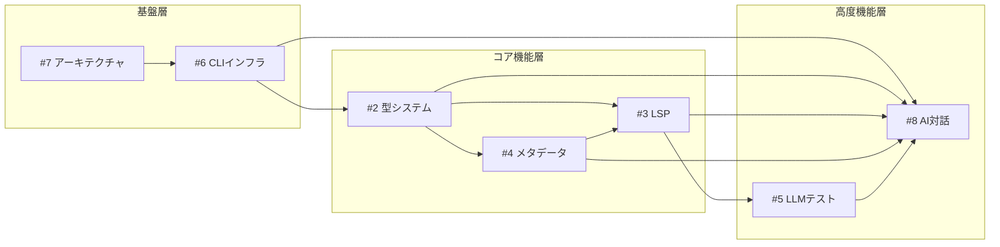

# Street Storyteller - Issue管理と開発計画

## 📚 目次

1. [プロジェクト概要](#プロジェクト概要)
2. [Issue一覧と詳細](#issue一覧と詳細)
3. [依存関係マップ](#依存関係マップ)
4. [開発ロードマップ](#開発ロードマップ)
5. [技術的詳細](#技術的詳細)
6. [リスク管理](#リスク管理)
7. [成功指標](#成功指標)

---

## プロジェクト概要

### ビジョン

**「物語創作をコードで支援し、AIとの対話で革新する」**

Street Storytellerは、SaC (StoryWriting as Code)
というコンセプトに基づき、物語の構造をTypeScriptで定義し、検証可能にすることで創作プロセスを支援します。最終的にはClaude
Codeのような対話型AIインターフェースで、誰もが直感的に高度な物語構造管理ツールを使えるようにします。

### 現状と課題

- **現状**: プロトタイプ段階で「とりあえず動く」レベル
- **課題**: アーキテクチャ不在、拡張性不足、学習コスト高、AI統合なし
- **解決**: 段階的な機能開発と最終的なAI統合による革新的UX

---

## Issue一覧と詳細

### 📋 Issue #2: TypeScript型による物語要素の表現力向上

**状態**: OPEN | **優先度**: 🔴 高 | **期間**: 1週間

#### 概要

現在の単純な型定義を拡張し、より表現力豊かで実用的な物語モデリングを実現。

#### 主要機能

1. **ハイブリッド方式の型設計**
   ```typescript
   export type Character = {
     name: string;
     displayNames?: string[]; // 原稿で使用される名前
     aliases?: string[]; // 別名・愛称
     role: "protagonist" | "antagonist" | "supporting" | "guest";
     summary: string;

     details?: {
       appearance?: string | { file: string };
       personality?: string | { file: string };
       backstory?: string | { file: string };
       development?: CharacterDevelopment;
     };

     detectionHints?: {
       commonPatterns: string[];
       excludePatterns: string[];
       confidence: number;
     };
   };
   ```

2. **段階的詳細追加機能**
   ```bash
   # 基本作成
   storyteller element character --name hero --role protagonist

   # 詳細追加
   storyteller element character --name hero --with-details

   # ファイル分離
   storyteller element character --name hero --separate-files backstory
   ```

#### 期待される効果

- 型安全性と記述の柔軟性を両立
- 段階的な詳細化が可能
- LSP機能での自然言語検出の基盤

---

### 📋 Issue #3: LSP統合による原稿チェック機能

**状態**: OPEN | **優先度**: 🟡 中 | **期間**: 2.5週間

#### 概要

Language Server Protocol統合により、リアルタイムで物語要素の整合性を検証。

#### 主要機能

1. **@なしキャラクター検出**
   ```markdown
   勇者は剣を抜いた。 → src/characters/hero.ts (95%) 「待て」と魔王が声をかけた。 →
   src/characters/demon_lord.ts (92%) 彼は立ち上がった。 → 文脈から推定 (65%)
   ```

2. **信頼度システム**
   - 段階的検出（明示的→完全一致→表示名→別名→文脈）
   - 文法パターン解析（助詞、動詞活用）
   - 曖昧性診断とQuick Fix

3. **エディタ統合**
   ```lua
   -- neovim設定例
   vim.keymap.set('n', 'gd', vim.lsp.buf.definition)  -- ジャンプ
   vim.keymap.set('n', 'K', vim.lsp.buf.hover)        -- ホバー情報
   vim.keymap.set('n', '<leader>@', convert_to_explicit) -- @付き変換
   ```

#### 実装フェーズ

- Stage 1: 基本LSP機能（3日）
- Stage 2: 基本診断（4日）
- Stage 3: @なし検出（7日）

---

### 📋 Issue #4: メタデータ自動生成機能

**状態**: OPEN | **優先度**: 🟡 中 | **期間**: 4日

#### 概要

章メタデータファイル（`.meta.ts`）を半自動的に生成し、TypeScriptとMarkdownの連携を効率化。

#### 主要機能

1. **自動生成コマンド**
   ```bash
   storyteller meta generate manuscripts/chapter01.md
   ```

2. **生成される内容**
   ```typescript
   export const chapter01Meta: ChapterMeta = {
     id: "chapter01",
     title: "旅の始まり",        // frontmatterから
     characters: [hero, heroine], // 内容を解析して検出
     settings: [kingdom],         // 内容を解析して検出
     validations: [...],          // 基本的な検証ルール
     references: {                // 参照マッピング
       "勇者": hero,
       "エリーゼ": heroine,
     }
   };
   ```

#### 期待される効果

- 手動作成の10分を10秒に短縮
- 一貫性のある検証ルール
- エラーの削減

---

### 📋 Issue #5: LLMベース自然言語テストシステム

**状態**: OPEN | **優先度**: 🟢 低 | **期間**: 1週間

#### 概要

物語の品質を自然言語で検証するLLMベースのテストシステムを導入。

#### 主要機能

1. **自然言語アサーション**
   ```yaml
   tests:
     - name: "勇者の性格描写の一貫性"
       assertion: |
         勇者は「正義感が強いが、やや天然」という
         性格設定に沿って描写されているか
       expected: true
   ```

2. **ハイブリッドアプローチ**
   - Level 1: 機械的チェック（高速・低コスト）
   - Level 2: LLM軽量チェック（中速・中コスト）
   - Level 3: LLM詳細分析（低速・高品質）

3. **コスト最適化**
   - ローカルLLM（Ollama）対応
   - キャッシュ活用
   - 段階的実行

---

### 📋 Issue #6: Phase 0 - CLIインフラとコマンド設計

**状態**: OPEN | **優先度**: 🔴 最高 | **期間**: 1週間

#### 概要

すべての機能の土台となるCLI環境を整備。

#### 主要機能

1. **グローバルコマンド化**
   ```bash
   # ビルドとインストール
   deno task build
   ./install.sh

   # グローバルで実行可能
   storyteller --help
   ```

2. **階層的コマンド構造**
   ```
   storyteller
   ├── generate     # プロジェクト生成
   ├── element      # 要素管理
   │   ├── character
   │   ├── plot
   │   └── setting
   ├── meta         # メタデータ管理
   ├── lsp          # Language Server
   └── validate     # 検証
   ```

3. **Zsh/Bash補完**
   ```bash
   storyteller <TAB>
   → generate element meta lsp validate help

   storyteller element character --<TAB>
   → --name --role --summary --with-details
   ```

---

### 📋 Issue #7: アーキテクチャ設計

**状態**: OPEN | **優先度**: 🔴 最高 | **期間**: 3日

#### 概要

クリーンで拡張可能なシステム構造を確立。

#### アーキテクチャ

```
┌─────────────────────────────────────────┐
│        Presentation Layer               │
│  (CLI, LSP, Web API)                   │
├─────────────────────────────────────────┤
│        Application Layer                │
│  (Use Cases, Services)                 │
├─────────────────────────────────────────┤
│         Domain Layer                    │
│  (Entities, Value Objects)             │
├─────────────────────────────────────────┤
│      Infrastructure Layer               │
│  (File System, External APIs)          │
└─────────────────────────────────────────┘
```

#### 主要パターン

1. **依存性注入（DI）**
   ```typescript
   export class DIContainer {
     register<T>(token: string, factory: () => T): void;
     get<T>(token: string): T;
   }
   ```

2. **リポジトリパターン**
   ```typescript
   export interface ICharacterRepository {
     findById(id: string): Promise<Character | null>;
     save(character: Character): Promise<void>;
   }
   ```

3. **コマンドパターン**
   ```typescript
   export abstract class BaseCommand {
     abstract execute(args: ParsedArgs): Promise<void>;
   }
   ```

---

### 📋 Issue #8: storyteller-ai - 対話型AI執筆支援

**状態**: OPEN | **優先度**: 🟢 低 | **期間**: 3週間

#### 概要

Claude Code風の対話型AI執筆支援インターフェース。

#### アーキテクチャ

```
┌────────────────────────────────┐
│      storyteller-ai            │  ← AI対話層
│   （別リポジトリ/別バイナリ）    │
├────────────────────────────────┤
│       storyteller              │  ← コアCLI層
│   （構造化出力・API提供）       │
└────────────────────────────────┘
```

#### 主要機能

1. **自然言語コマンド実行**
   ```
   User: 主人公のキャラクターを作って
   AI: 主人公キャラクターを作成します。
   実行: storyteller element character --name hero --role protagonist
   ```

2. **対話的プロジェクト初期化**
   ```
   AI: どんな物語を作りたいですか？
   User: ファンタジー小説
   AI: 構成を提案します...
   ```

3. **コンテキスト認識型執筆支援**
   ```
   User: 第3章の勇者の性格がブレてる
   AI: 分析しました。以下の矛盾があります...
   ```

4. **創作相談機能**
   ```
   User: 挫折シーンのアイデアある？
   AI: 現在の設定を踏まえて提案します...
   ```

---

### 📋 Issue #9: 統合開発計画（ロードマップ）

**状態**: OPEN | **優先度**: - | **期間**: 全体管理

#### 概要

全issueを統括し、12週間の開発計画を管理する親issue。

---

## 依存関係マップ



### 依存関係の説明

- **#7 → #6**: アーキテクチャ設計がCLI実装の前提
- **#6 → #2**: CLIインフラが型システムコマンドの基盤
- **#2 → #3,#4**: 型定義（displayNames等）がLSPとメタデータ生成で必要
- **#3,#4,#5 → #8**: すべての機能がAI対話層で活用される

---

## 開発ロードマップ

### 📅 12週間の開発計画

#### Phase 1: 基盤構築（Week 1-2）

```
Week 1: アーキテクチャとCLI基盤
├── Day 1-3: #7 アーキテクチャ設計
│   ├── レイヤー構造の実装
│   ├── DIコンテナ
│   └── エラーハンドリング
└── Day 4-7: #6 CLIインフラ基本
    ├── コマンドレジストリ
    ├── storytellerビルド
    └── 構造化出力

Week 2: 補完と型システム基礎
├── Day 8-9: #6 Zsh/Bash補完
│   └── 補完ファイルとインストール
└── Day 10-12: #2 型システムStep 1
    ├── Character型拡張
    └── element characterコマンド
```

**🏁 Milestone 1**: 基本CLI完成、すぐに使い始められる

#### Phase 2: コア機能実装（Week 3-4）

```
Week 3: 型システム完成とメタデータ基礎
├── Day 13-15: #2 型システムStep 2
│   ├── detectionHints
│   └── --with-details
└── Day 16-17: #4 メタデータStep 1
    └── meta generateコマンド

Week 4: メタデータ高度化とLSP基礎
├── Day 18-19: #4 メタデータStep 2
│   └── displayNames検出
└── Day 20-22: #3 LSP Stage 1
    ├── LSPサーバー基本
    └── @付き参照ジャンプ
```

**🏁 Milestone 2**: 実用レベル達成、日常的な執筆作業で活用可能

#### Phase 3: 高度な機能（Week 5-7）

```
Week 5-6: LSP完成
└── #3 LSP Stage 2 & 3（14日）
    ├── 診断機能
    ├── @なし検出エンジン
    ├── 信頼度システム
    ├── 文脈解析
    └── Code Action

Week 7: 品質保証
└── #5 LLMテストMVP（7日）
    ├── テストランナー
    ├── YAML定義
    └── Ollama対応
```

**🏁 Milestone 3**: プロ機能完成、プロフェッショナルな執筆環境

#### Phase 4: AI統合（Week 8-10）

```
Week 8-10: storyteller-ai実装
├── Week 8: 基本対話ループ
├── Week 9: コンテキスト管理
└── Week 10: 創作相談機能
```

**🏁 Milestone 4**: AI統合完成、革新的な執筆体験

#### Phase 5: 最適化と完成（Week 11-12）

```
Week 11-12: 仕上げ
├── パフォーマンス最適化
├── テストカバレッジ80%
├── ドキュメント完成
├── CI/CD設定
└── v1.0リリース
```

**🏁 Milestone 5**: v1.0リリース、完成された製品

---

## 技術的詳細

### コア技術スタック

```yaml
Runtime: Deno 2.x
Language: TypeScript
Test: Deno標準テストランナー
LSP: JSON-RPC over stdio
LLM: OpenAI/Anthropic/Ollama
CLI: @std/cli
```

### ディレクトリ構造（目標）

```
street-storyteller/
├── src/
│   ├── presentation/      # プレゼンテーション層
│   │   ├── cli/          # CLIコマンド
│   │   ├── lsp/          # Language Server
│   │   └── api/          # Web API（将来）
│   ├── application/       # アプリケーション層
│   │   ├── services/     # ビジネスロジック
│   │   └── use-cases/    # ユースケース
│   ├── domain/           # ドメイン層
│   │   ├── entities/     # エンティティ
│   │   └── repositories/ # リポジトリインターフェース
│   └── infrastructure/   # インフラ層
│       ├── persistence/  # データ永続化
│       └── config/       # 設定管理
├── tests/                # テスト
├── docs/                 # ドキュメント
└── scripts/              # ビルド・デプロイスクリプト
```

### API設計

```typescript
// storytellerコアAPI
export interface StorytellerAPI {
  // 構造化された入出力
  execute(command: Command): Promise<Result>;

  // ストリーミング対応
  stream(command: Command): AsyncIterable<ProgressUpdate>;

  // バッチ実行
  batch(commands: Command[]): Promise<Result[]>;

  // クエリ
  query(query: Query): Promise<QueryResult>;

  // 検証
  validate(options: ValidationOptions): Promise<ValidationResult>;
}
```

### 設定ファイル構造

```yaml
# ~/.storytellerrc (グローバル設定)
defaults:
  template: novel
  language: ja

# .storytellerrc (プロジェクト設定)
project:
  name: my-story
  type: fantasy

validation:
  strict: true
  autoFix: false

lsp:
  enableImplicit: true
  confidenceThreshold: 0.6
```

---

## リスク管理

### 技術的リスク

| リスク             | 影響度 | 発生確率 | 対策                              |
| ------------------ | ------ | -------- | --------------------------------- |
| LSP実装の複雑さ    | 高     | 中       | 段階的実装、MVPから開始           |
| LLMコストの増大    | 中     | 高       | ローカルLLM活用、キャッシュ       |
| パフォーマンス劣化 | 高     | 中       | 早期ベンチマーク、非同期処理      |
| 過度の抽象化       | 中     | 中       | YAGNI原則、段階的リファクタリング |

### スケジュールリスク

| リスク                     | 影響度 | 発生確率 | 対策                   |
| -------------------------- | ------ | -------- | ---------------------- |
| アーキテクチャ再設計の遅延 | 高     | 低       | 段階的マイグレーション |
| AI統合の複雑さ             | 中     | 中       | MVPから開始            |
| テスト不足                 | 高     | 中       | TDD、CI/CD早期導入     |

### 対策優先順位

1. **最優先**: 基盤部分の品質確保（#7, #6）
2. **高優先**: 段階的リリースによるフィードバック収集
3. **中優先**: ドキュメント同時作成
4. **低優先**: 完璧主義の回避

---

## 成功指標

### 技術的指標

| 指標             | 目標値    | 測定方法          |
| ---------------- | --------- | ----------------- |
| テストカバレッジ | 80%以上   | Deno coverage     |
| 型カバレッジ     | 95%以上   | TypeScript strict |
| パフォーマンス   | 100ms以下 | コマンド実行時間  |
| メモリ使用量     | 100MB以下 | Runtime測定       |
| エラー率         | 1%以下    | エラーログ分析    |

### ビジネス指標

| 指標                     | 4週間後 | 8週間後 | 12週間後 |
| ------------------------ | ------- | ------- | -------- |
| 日次アクティブユーザー   | 10      | 50      | 100      |
| GitHub Stars             | 50      | 200     | 500      |
| コントリビューター       | 1       | 3       | 5        |
| プロダクション利用       | 1       | 5       | 10       |
| ポジティブフィードバック | 80%     | 85%     | 90%      |

### 定性的指標

- **使いやすさ**: 初心者が30分以内に基本機能を習得
- **拡張性**: プラグイン開発が容易
- **コミュニティ**: 活発な議論と貢献
- **ドキュメント**: 包括的で分かりやすい
- **革新性**: 既存ツールにない価値提供

---

## 次のアクション

### 即座に開始（Day 1-2）

1. [ ] アーキテクチャ設計ドキュメント作成
2. [ ] src/ディレクトリ構造の再編成
3. [ ] 基本的なDIコンテナ実装
4. [ ] エラーハンドリング基盤構築
5. [ ] CI/CD環境セットアップ

### Week 1終了までに

1. [ ] storytellerコマンドのビルド成功
2. [ ] 基本的なヘルプシステム動作
3. [ ] 構造化出力（JSON）対応
4. [ ] 最初のユニットテスト作成
5. [ ] CONTRIBUTING.md作成

### 継続的タスク

- 週次進捗レポート（毎週月曜）
- issueのステータス更新
- ドキュメント更新
- コミュニティとのコミュニケーション

---

## 参考リンク

### プロジェクト内

- [README.md](README.md) - プロジェクト概要
- [CLAUDE.md](CLAUDE.md) - Claude Code用ガイド
- [sample/](sample/) - サンプル実装

### GitHub Issues

- [#2 型システム拡張](https://github.com/nekowasabi/street-storyteller/issues/2)
- [#3 LSP統合](https://github.com/nekowasabi/street-storyteller/issues/3)
- [#4 メタデータ自動生成](https://github.com/nekowasabi/street-storyteller/issues/4)
- [#5 LLMテスト](https://github.com/nekowasabi/street-storyteller/issues/5)
- [#6 CLIインフラ](https://github.com/nekowasabi/street-storyteller/issues/6)
- [#7 アーキテクチャ設計](https://github.com/nekowasabi/street-storyteller/issues/7)
- [#8 storyteller-ai](https://github.com/nekowasabi/street-storyteller/issues/8)
- [#9 統合開発計画](https://github.com/nekowasabi/street-storyteller/issues/9)

### 外部参考

- [Deno Documentation](https://deno.land/)
- [LSP Specification](https://microsoft.github.io/language-server-protocol/)
- [Clean Architecture](https://blog.cleancoder.com/uncle-bob/2012/08/13/the-clean-architecture.html)
- [Claude Code](https://claude.ai/code)

---

_最終更新: 2025-08-24_ _このドキュメントは開発の進行に応じて更新されます_
