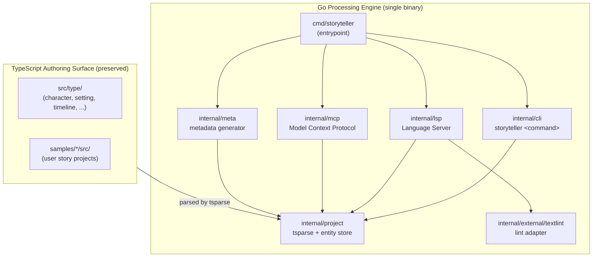

# street-storyteller


**Version**: 0.3.0 (CLI) / 1.0.0 (Project Schema)

> Story Writing as Code (SaC) — 物語の構造を型安全な TypeScript で表現し、Go 製の単一バイナリで検証・可視化・LSP/MCP 統合まで提供するツールキット。

## What is street-storyteller

street-storyteller は SaC (StoryWriting as Code) コンセプトに基づき、キャラクター・設定・タイムライン・伏線・サブプロットといった物語要素を **型安全な TypeScript** で記述し、整合性をプログラムで検証可能にする創作支援ツールです。

ランタイムは Go で実装された単一バイナリ (`storyteller`) として配布され、CLI / LSP / MCP / textlint 統合をひとつの実行ファイルで提供します。

## Features

- **Go-powered single binary**: 依存ゼロでインストール可能 (`storyteller`)
- **Type-safe authoring surface**: TypeScript で物語要素を記述し、IDE 補完と型チェックを活用
- **CLI**: プロジェクト生成、要素作成、メタデータ検証、可視化
- **LSP server**: 原稿 (Markdown) からエンティティ参照をリアルタイム検出・診断 (`storyteller lsp start --stdio`)
- **MCP server**: Claude Desktop / Claude Code から物語データへ tools / resources / prompts でアクセス
- **textlint integration**: 文法・表記ゆれ検出を LSP に統合
- **Story elements**: characters, settings, timelines, foreshadowings, subplots, beats, intersections

## Installation

### Quick install (curl)

```bash
curl -fsSL https://raw.githubusercontent.com/nekowasabi/street-storyteller/main/scripts/install.sh | sh
```

`$HOME/.local/bin/storyteller` にインストールされます。`--prefix` で配置先を変更可能:

```bash
curl -fsSL https://raw.githubusercontent.com/nekowasabi/street-storyteller/main/scripts/install.sh \
  | sh -s -- --prefix /usr/local/bin
```

### Homebrew (macOS / Linux)

```bash
brew tap nekowasabi/street-storyteller https://github.com/nekowasabi/street-storyteller
brew install storyteller
```

> Note: 公式 tap repo の公開は今後の作業です。現状はリポジトリ内 `Formula/storyteller.rb`
> を `brew install --build-from-source ./Formula/storyteller.rb` で利用できます。

### Manual download

GitHub Releases からプラットフォーム別バイナリ
(`storyteller-vX.Y.Z-<os>-<arch>.tar.gz`) をダウンロードして展開し、PATH に配置してください。

### Build from source

```bash
git clone https://github.com/nekowasabi/street-storyteller.git
cd street-storyteller
go build -o storyteller ./cmd/storyteller
cp storyteller "$HOME/.local/bin/storyteller"
```

## Quick Start

```bash
# 1. インストール
curl -fsSL https://raw.githubusercontent.com/nekowasabi/street-storyteller/main/scripts/install.sh | sh

# 2. 新規プロジェクト作成
storyteller generate --name my-story --template basic
cd my-story

# 3. キャラクター作成
storyteller element character --name hero --role protagonist \
  --summary "Brave young warrior who seeks the lost sword"

# 4. 原稿の整合性をチェック
storyteller meta check --dir manuscripts --recursive

# 5. ブラウザで可視化
storyteller view browser
```

## Architecture

street-storyteller は **Go 処理エンジン** と **TypeScript authoring surface** の二層構造です。詳細は [`docs/architecture.md`](docs/architecture.md) を参照してください。



ASCII 版:

```
┌─────────────────────────────────────────────┐
│  TypeScript Authoring Surface (preserved)   │
│  src/{type,characters,settings,timelines,   │
│       foreshadowings,subplots}/             │
│  samples/*/src/                             │
└──────────────────────┬──────────────────────┘
                       │ parsed by tsparse
                       ▼
┌─────────────────────────────────────────────┐
│  Go Processing Engine (single binary)       │
│  cmd/storyteller + internal/                │
│  ├─ cli/      storyteller <command>         │
│  ├─ lsp/      Language Server               │
│  ├─ mcp/      Model Context Protocol        │
│  ├─ meta/     metadata generator            │
│  ├─ project/  tsparse + entity store        │
│  └─ external/textlint/  lint adapter        │
└─────────────────────────────────────────────┘
```

- **TypeScript = authoring surface**: ユーザーが物語要素を型安全に記述する編集面。`src/type/` の型定義と `samples/*/src/` のプロジェクト記述が該当します。
- **Go = processing engine**: CLI / LSP / MCP / meta 生成 / 可視化のすべてのランタイム機能を担当。新規ランタイム機能は原則 Go 側に実装されます。

## Commands at a glance

| Command | Description |
|---------|-------------|
| `storyteller generate` | 新規物語プロジェクトを初期化 |
| `storyteller element <kind>` | 物語要素を作成 (character / setting / timeline / event / foreshadowing / subplot / beat / intersection / phase) |
| `storyteller view <kind>` | 物語要素を表示 (character / setting / timeline / foreshadowing / subplot / browser) |
| `storyteller meta generate` | 原稿から `.meta.ts` 伴走ファイルを生成 |
| `storyteller meta check` | メタデータ整合性を検証 (CI / pre-commit 向け) |
| `storyteller meta watch` | 原稿の変更を監視して `.meta.ts` を更新 |
| `storyteller lint` | 原稿に textlint を実行（`--fix` で自動修正） |
| `storyteller lsp start --stdio` | LSP サーバーを stdio で起動 |
| `storyteller lsp install <editor>` | エディタ統合設定を生成 (nvim / vscode) |
| `storyteller lsp validate <path>` | ワンショット原稿検証 |
| `storyteller mcp start --stdio` | MCP サーバーを stdio で起動 |
| `storyteller mcp init` | Claude Desktop 用の設定スニペットを出力 |
| `storyteller update --check` / `--apply` | インストール済みバイナリの管理 |
| `storyteller version` | バージョン表示 |
| `storyteller help` | ヘルプ表示 |

CLI の詳細は [`docs/cli.md`](docs/cli.md) を参照してください。

## Editor Integration (LSP)

`storyteller lsp` は Markdown 原稿からキャラクター・設定・伏線への参照を検出し、リアルタイムで診断・ホバー・定義ジャンプ・コードアクション・セマンティックトークンを提供します。

```bash
# Neovim 用設定を生成
storyteller lsp install nvim

# VSCode 用設定を生成
storyteller lsp install vscode

# サーバー単体起動 (エディタから接続)
storyteller lsp start --stdio
```

詳細は [`docs/lsp.md`](docs/lsp.md) を参照してください。

## MCP Integration (Claude Desktop / Claude Code)

`storyteller mcp start --stdio` で Model Context Protocol サーバーを起動し、Claude Desktop など MCP クライアントから tools / resources / prompts にアクセスできます。

Claude Desktop 設定例 (`claude_desktop_config.json`):

```json
{
  "mcpServers": {
    "storyteller": {
      "command": "storyteller",
      "args": ["mcp", "start", "--stdio"]
    }
  }
}
```

公開している主な API:

- **Tools**: `meta_check`, `meta_generate`, `element_create`, `view_browser`, `lsp_validate`, `lsp_find_references`, `timeline_create`, `event_create`, `event_update`, `timeline_view`, `timeline_analyze`, `foreshadowing_create`, `foreshadowing_view`, `manuscript_binding`, `subplot_create`, `subplot_view`, `beat_create`, `intersection_create`
- **Resources**: `storyteller://project`, `storyteller://characters`, `storyteller://character/<id>`, `storyteller://settings`, `storyteller://setting/<id>`, `storyteller://timelines`, `storyteller://timeline/<id>`, `storyteller://foreshadowings`, `storyteller://foreshadowing/<id>`, `storyteller://subplots`, `storyteller://subplot/<id>`
- **Prompts**: `character_brainstorm`, `plot_suggestion`, `scene_improvement`, `project_setup_wizard`, `chapter_review`, `consistency_fix`, `timeline_brainstorm`, `event_detail_suggest`, `causality_analysis`, `timeline_consistency_check`

詳細は [`docs/mcp.md`](docs/mcp.md) を参照してください。

## Generated Project Structure

```
story-project/
├── src/                # Story structure definitions (TypeScript)
│   ├── characters/     # Character definitions
│   ├── settings/       # Story settings
│   ├── chapters/       # Chapter structure
│   ├── plots/          # Plot development
│   ├── timelines/      # Timeline management
│   ├── foreshadowings/ # Foreshadowing tracking
│   ├── subplots/       # Subplot management
│   ├── themes/         # Theme definitions
│   ├── structure/      # Story structure
│   └── purpose/        # Story purpose
├── manuscripts/        # Actual story manuscripts (Markdown)
├── drafts/             # Draft notes and ideas
├── output/             # Generated output for AI collaboration
├── tests/              # Story validation tests
├── story.ts            # Main story implementation
├── story.config.ts     # Project configuration
└── README.md           # Project documentation
```

### Templates

- `basic` - Basic story structure with all core elements
- `novel` - Novel-focused structure with extended character development
- `screenplay` - Screenplay structure with scene-based organization

## Documentation

| Document | Contents |
|----------|----------|
| [`docs/architecture.md`](docs/architecture.md) | 二層構造アーキテクチャの詳細 |
| [`docs/cli.md`](docs/cli.md) | CLI コマンドリファレンス |
| [`docs/lsp.md`](docs/lsp.md) | LSP サーバーと診断機能 |
| [`docs/mcp.md`](docs/mcp.md) | MCP tools / resources / prompts |
| [`docs/lint.md`](docs/lint.md) | textlint 統合と Git hooks |
| [`docs/meta-generate.md`](docs/meta-generate.md) | `.meta.ts` 生成の仕組み |
| [`docs/character-phase.md`](docs/character-phase.md) | キャラクターフェーズ管理 |
| [`docs/subplot.md`](docs/subplot.md) | サブプロット機能の詳細 |
| [`docs/ui-guide.md`](docs/ui-guide.md) | ブラウザ可視化のガイド |

## Development

### Build & Test (Go)

```bash
# Build
go build -o storyteller ./cmd/storyteller

# Run all Go tests
go test ./...

# Run with cache control
GOCACHE=/tmp/sst-cache go test ./... -count=1
```

### Authoring Surface (TypeScript)

```bash
# Format check
deno fmt --check

# Lint
deno lint

# TypeScript authoring tests
deno task test:authoring

# Meta check on samples
deno task meta:check
```

### Quality Gates

- **Go test**: `go test ./...` で全パッケージのテストが通ること
- **Format/Lint**: `deno fmt --check` と `deno lint`
- **Meta check**: `storyteller meta check` で原稿の整合性を確認

## Roadmap

- [x] Go 製単一バイナリへの移行
- [x] CLI / LSP / MCP / textlint の Go 実装
- [x] Story elements を TypeScript 型で表現
- [x] 原稿のキャラクター・設定参照検証
- [x] 伏線管理 (foreshadowings)
- [x] タイムライン管理 (timelines)
- [x] サブプロット管理 (subplots)
- [x] textlint による表記ゆれ検出
- [x] ブラウザ可視化
- [ ] AI を活用した執筆支援 (LLM UI/UX 統合は計画中)
- [ ] vim statusline 連携

## License

MIT (see [LICENSE](LICENSE) if present).

## Misc

Inspired by
[StreetStoryteller in StrategicStoratosphere](http://motonaga.world.coocan.jp/).
