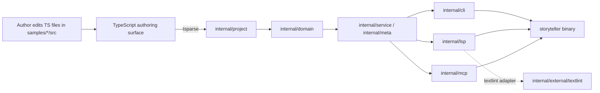

# Architecture: Go/TypeScript Two-Layer Architecture

`storyteller` は **Go 処理エンジン** と **TypeScript authoring surface** の二層構造で構成される。本ドキュメントは Go 移植後の現状を反映した正準アーキテクチャ憲章である。

> 関連: [README.md](../README.md) / [docs/cli.md](./cli.md) / [docs/lsp.md](./lsp.md) / [docs/mcp.md](./mcp.md) / [docs/lint.md](./lint.md) / [docs/benchmarks.md](./benchmarks.md)

## Commander's Intent

- 単一の Go バイナリで CLI / LSP / MCP / view を提供し、起動レイテンシと配布性を改善する。
- 物語要素（キャラクター・設定・タイムライン etc.）は引き続き TypeScript 型として記述する（StoryWriting as Code の不変条件）。
- E2E 最小主義。品質保証はユニット・golden・narrow integration を中心に置く。

## Layer 1: Go Processing Engine

ユーザーが `storyteller` バイナリ越しに触れる実行パスは Go が担う。

| レイヤ | パッケージ | 責務 |
|--------|-----------|------|
| エントリ | `cmd/storyteller` | バイナリ entrypoint、golden test 駆動 |
| CLI | `internal/cli`, `internal/cli/modules/*` | サブコマンドのレジストリと presenter |
| Domain | `internal/domain` | Character / Setting / Timeline / Foreshadowing / Plot / Beat 等の型と検証 |
| Project parsing | `internal/project`, `internal/project/tsparse` | TypeScript 認可サブセットを Go 側で読み取る |
| Service | `internal/service` | meta_check / generate などのユースケース |
| Meta | `internal/meta` | YAML frontmatter 検証・emitter |
| Detect | `internal/detect` | 原稿内のエンティティ参照検出 |
| LSP | `internal/lsp/{server,protocol,providers,diagnostics}` | LSP サーバ実装 |
| MCP | `internal/mcp/{server,protocol,tools,resources,prompts}` | MCP サーバ実装 |
| External | `internal/external/textlint` | textlint プロセス連携アダプタ |
| Test 基盤 | `internal/testkit`, `internal/errors` | 共有テストヘルパ・エラーラッピング |

新規ランタイム機能は原則 Go 側に追加する。`src/cli`, `src/lsp`, `src/mcp`, `src/rag` などの旧 TypeScript 実装は撤去済み（移植完了）。

## Layer 2: TypeScript Authoring Surface

著者が直接編集する型情報は TypeScript のまま維持する。

| 用途 | パス |
|------|------|
| 共有物語型 | `src/type/` |
| ルート例 | `src/characters/`, `src/settings/`, `src/timelines/`, `src/foreshadowings/` |
| サンプルプロジェクト | `samples/cinderella/src/`, `samples/momotaro/src/`, etc. |

`samples/*/src/` で記述された TypeScript リテラルを Go の `internal/project/tsparse` が読み取り、Domain オブジェクトに変換する。Deno は authoring 時の型チェック用途で利用するが、CLI / LSP / MCP の実行には不要。

## データフロー

## E2E Minimalism

- 既定: ユニット / golden test / 限定的 integration test
- E2E は配布 (binary install)、性能 (startup latency)、エディタ実起動など、より小さなテストでは検証不能なリスクに対してのみ追加
- 性能ベースラインは [docs/benchmarks.md](./benchmarks.md) に集約

## 不変条件

- `storyteller` の runtime 動作は Go で実装する。
- TypeScript で物語要素を記述できることを破壊しない。
- `src/type/` と `samples/*/src/` を撤去しない。
- Go パーサは samples が使う TypeScript subset を解釈し続ける。
- Deno は通常の CLI / LSP / MCP 実行に不要。
- E2E カバレッジは小さく、追加には正当化（owner / purpose / failure signal）が必要。

## 移行履歴（参考）

- `src/cli`, `src/lsp`, `src/mcp`, `src/rag` 配下の TypeScript ランタイムは Go 移植完了に伴い削除済み。
- 旧 RAG モジュールおよび `deno compile` を前提とした配布手順は廃止。Go バイナリ単体配布へ統一。
- 詳細は `docs/migration/` および `plan/process-*.md` を参照。
