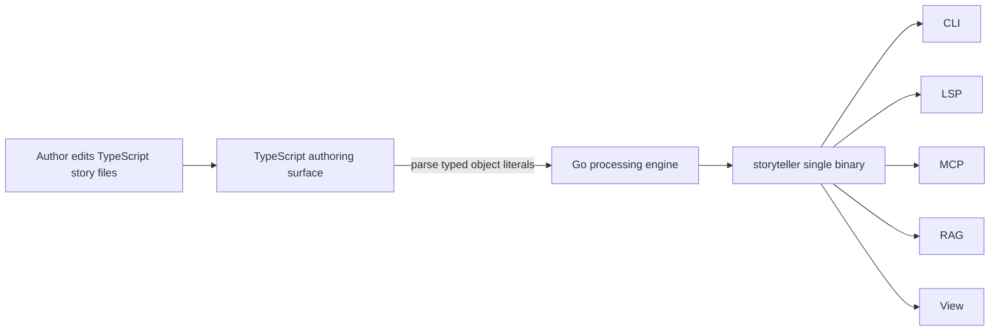

# Go/TypeScript Two-Layer Architecture

This document is the migration charter for the Go-powered storyteller engine.
It defines the boundary that all migration phases must preserve.

## Commander's Intent

`storyteller` is moving toward a single Go binary for runtime behavior while
keeping TypeScript as the authoring surface for story elements. The migration
must improve CLI/LSP latency and distribution without weakening StoryWriting as
Code.

## Layer 1: Go Processing Engine

Go owns all execution paths that users run through the `storyteller` binary.

| Area | Packages |
| --- | --- |
| CLI | `cmd/storyteller`, `internal/cli` |
| Services | `internal/service`, `internal/meta`, `internal/project` |
| Language tooling | `internal/lsp`, `internal/detect` |
| Integrations | `internal/mcp`, `internal/external`, `internal/rag` |
| Domain model | `internal/domain` |

New runtime commands and adapters must be implemented in Go. TypeScript runtime
modules under `src/cli`, `src/lsp`, `src/mcp`, and `src/rag` are migration
sources and are retired after their Go equivalents are complete.

## Layer 2: TypeScript Authoring Surface

TypeScript remains the format authors edit for story structure. These paths are
preserved as authoring APIs and sample material:

| Area | Paths |
| --- | --- |
| Shared story types | `src/type/` |
| Root example entities | `src/characters/`, `src/settings/`, `src/timelines/`, `src/foreshadowings/` |
| Sample projects | `samples/*/src/` |

The README promise that story elements can be expressed in TypeScript types is
an invariant. Deno remains available for authoring type checks, not for the main
runtime engine.

## Responsibility Map

## E2E Minimalism

Default quality gates should prefer unit tests, golden tests, and narrow
integration tests. End-to-end tests are added only when they verify behavior
that smaller tests cannot cover, such as distribution, installation, or measured
startup performance.

Long-running or environment-sensitive E2E tests are migration candidates for
Process 13. When an E2E test is retained, it must have a clear owner, purpose,
and failure signal.

## Invariants

- `storyteller` runtime behavior is implemented in Go.
- TypeScript story files remain the authoring contract.
- `src/type/` and `samples/*/src/` are preserved.
- Go parsers must understand the TypeScript authoring subset used by samples.
- Deno is not required for normal CLI/LSP/MCP execution.
- E2E coverage is intentionally small and justified by concrete risk.
