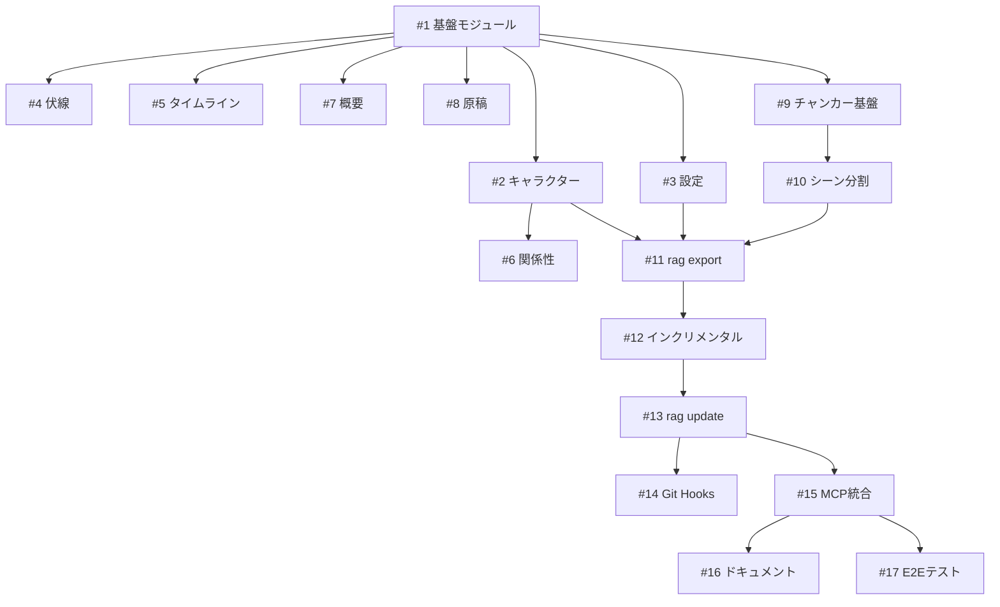

# RAG統合 - 実装タスク一覧（GitHub Issue形式）

> このドキュメントはGitHub
> Issueとして作成可能な形式で実装タスクを定義しています。

---

## Issue #1: RAG基盤モジュール構造作成

### タイトル

`feat(rag): RAG基盤モジュール構造を作成`

### ラベル

- `enhancement`
- `rag`
- `phase-1`

### 概要

storyteller
RAG統合の基盤となるディレクトリ構造とインターフェース定義を作成する。

### 完了条件

- [ ] `src/rag/` ディレクトリ構造作成
  ```
  src/rag/
  ├── mod.ts              # モジュールエクスポート
  ├── types.ts            # 型定義
  ├── document_generator.ts
  ├── chunker.ts
  ├── templates/
  │   └── mod.ts
  └── metadata/
      └── mod.ts
  ```
- [ ] `RagDocument` インターフェース定義
- [ ] `GeneratorOptions` インターフェース定義
- [ ] `ChunkingOptions` インターフェース定義
- [ ] 基本テストファイル作成

### 技術詳細

```typescript
// src/rag/types.ts

export interface RagDocument {
  id: string;
  title: string;
  date: string;
  tags: string[];
  content: string;
  sourcePath: string;
}

export interface GeneratorOptions {
  outputDir: string;
  manuscriptFormat: "full" | "summary";
  chunking: ChunkingOptions;
  incremental: boolean;
}

export interface ChunkingOptions {
  strategy: "document" | "scene" | "semantic" | "auto";
  maxChunkChars: number;
  overlapChars: number;
  minChunkChars: number;
}

export interface ExportResult {
  documentCount: number;
  errors: ExportError[];
  duration: number;
  diff?: {
    added: number;
    modified: number;
    removed: number;
    unchanged: number;
  };
}
```

### 推定工数

1日

### 依存関係

なし

---

## Issue #2: キャラクタードキュメントテンプレート実装

### タイトル

`feat(rag): キャラクタードキュメント生成テンプレートを実装`

### ラベル

- `enhancement`
- `rag`
- `phase-1`

### 概要

Character型からdigrag互換のMarkdownドキュメントを生成するテンプレートを実装する。

### 完了条件

- [ ] `src/rag/templates/character.ts` 作成
- [ ] digrag ChangelogEntry形式の出力
- [ ] タグ自動生成（role, chapters, traits）
- [ ] 関係性セクション生成
- [ ] 成長フェーズセクション生成（phases対応）
- [ ] ユニットテスト作成

### 出力例

```markdown
- Character: シンデレラ 2025-01-15 Tags: character, protagonist, chapter01,
  chapter02, 優しい, 忍耐強い

  ## 基本情報
  - ID: cinderella
  - 名前: シンデレラ
  - 役割: protagonist
  - 登場チャプター: chapter01, chapter02

  ## 性格・特徴
  - 優しい
  - 忍耐強い

  ## 関係性
  - 継母 (stepmother): 対立関係
  - 王子 (prince): 恋愛関係

  ## 概要
  継母にいじめられながらも希望を失わない少女

  ## 成長フェーズ
  - Phase 1 (chapter01-02): 虐げられた日常
  - Phase 2 (chapter03): 魔法との出会い
```

### 推定工数

1日

### 依存関係

- Issue #1

---

## Issue #3: 設定ドキュメントテンプレート実装

### タイトル

`feat(rag): 設定ドキュメント生成テンプレートを実装`

### ラベル

- `enhancement`
- `rag`
- `phase-1`

### 概要

Setting型からdigrag互換のMarkdownドキュメントを生成するテンプレートを実装する。

### 完了条件

- [ ] `src/rag/templates/setting.ts` 作成
- [ ] タイプ別タグ生成（location, item, system等）
- [ ] 関連設定セクション生成
- [ ] displayNames/検出ヒント対応
- [ ] ユニットテスト作成

### 推定工数

0.5日

### 依存関係

- Issue #1

---

## Issue #4: 伏線ドキュメントテンプレート実装

### タイトル

`feat(rag): 伏線ドキュメント生成テンプレートを実装`

### ラベル

- `enhancement`
- `rag`
- `phase-2`

### 概要

Foreshadowing型からdigrag互換のMarkdownドキュメントを生成するテンプレートを実装する。

### 完了条件

- [ ] `src/rag/templates/foreshadowing.ts` 作成
- [ ] ステータス別タグ生成（planted, resolved等）
- [ ] 設置情報セクション生成
- [ ] 回収情報セクション生成
- [ ] 関連要素（キャラクター、設定）リンク
- [ ] ユニットテスト作成

### 出力例

```markdown
- Foreshadowing: ガラスの靴の伏線 2025-01-15 Tags: foreshadowing, chekhov,
  major, planted, chapter02

  ## 基本情報
  - ID: glass_slipper_foreshadowing
  - タイプ: chekhov
  - 重要度: major
  - 状態: planted

  ## 設置情報
  - チャプター: chapter02
  - 説明: 妖精のおばあさんが特別なガラスの靴を用意する

  ## 関連要素
  - キャラクター: fairy_godmother, cinderella
  - 設定: glass_slipper

  ## 回収予定
  - 予定チャプター: chapter04
```

### 推定工数

1日

### 依存関係

- Issue #1

---

## Issue #5: タイムライン/イベントドキュメントテンプレート実装

### タイトル

`feat(rag): タイムライン/イベントドキュメント生成テンプレートを実装`

### ラベル

- `enhancement`
- `rag`
- `phase-2`

### 概要

Timeline/TimelineEvent型からdigrag互換のMarkdownドキュメントを生成するテンプレートを実装する。

### 完了条件

- [ ] `src/rag/templates/timeline.ts` 作成
- [ ] タイムライン概要ドキュメント生成
- [ ] イベント個別ドキュメント生成
- [ ] 因果関係（causedBy/causes）セクション
- [ ] scope別タグ生成（story, world, character, arc）
- [ ] ユニットテスト作成

### 推定工数

1日

### 依存関係

- Issue #1

---

## Issue #6: 関係性グラフドキュメント生成

### タイトル

`feat(rag): 関係性グラフドキュメント生成を実装`

### ラベル

- `enhancement`
- `rag`
- `phase-2`

### 概要

プロジェクト内の全キャラクター関係性を集約したグラフドキュメントを生成する。

### 完了条件

- [ ] `src/rag/templates/relationships.ts` 作成
- [ ] 関係タイプ別グルーピング
- [ ] 双方向関係の表示
- [ ] Mermaidグラフ形式オプション
- [ ] ユニットテスト作成

### 出力例

```markdown
- Relationships: キャラクター関係性グラフ 2025-01-15 Tags: relationships, graph,
  meta

  ## 対立関係
  - シンデレラ ←→ 継母: 虐待する/耐える

  ## 恋愛関係
  - シンデレラ ←→ 王子: 相思相愛

  ## 支援関係
  - 妖精のおばあさん → シンデレラ: 魔法で支援
```

### 推定工数

0.5日

### 依存関係

- Issue #2

---

## Issue #7: プロジェクト概要（_index.md）生成

### タイトル

`feat(rag): プロジェクト概要ドキュメント生成を実装`

### ラベル

- `enhancement`
- `rag`
- `phase-2`

### 概要

プロジェクト全体の統計・概要を含む`_index.md`を生成する。

### 完了条件

- [ ] `src/rag/templates/index.ts` 作成
- [ ] プロジェクト統計（キャラクター数、設定数等）
- [ ] 主要キャラクター一覧
- [ ] あらすじセクション
- [ ] 執筆状況セクション
- [ ] ユニットテスト作成

### 推定工数

0.5日

### 依存関係

- Issue #1

---

## Issue #8: 原稿ドキュメント生成（full/summary）

### タイトル

`feat(rag): 原稿ドキュメント生成を実装（full/summary両対応）`

### ラベル

- `enhancement`
- `rag`
- `phase-2`

### 概要

Markdown原稿ファイルをdigrag互換ドキュメントに変換する。
全文保存モードと要約保存モードの両方に対応。

### 完了条件

- [ ] `src/rag/templates/manuscript.ts` 作成
- [ ] FrontMatterからメタデータ抽出
- [ ] 全文保存モード（full）実装
- [ ] 要約保存モード（summary）実装
- [ ] キャラクター/設定タグ自動付与
- [ ] ユニットテスト作成

### 推定工数

1日

### 依存関係

- Issue #1

---

## Issue #9: チャンキングエンジン - ドキュメント単位

### タイトル

`feat(rag): チャンキングエンジン基盤とドキュメント単位分割を実装`

### ラベル

- `enhancement`
- `rag`
- `phase-1.5`

### 概要

チャンキングエンジンの基盤と、小規模ファイル用のドキュメント単位分割を実装する。

### 完了条件

- [ ] `src/rag/chunker.ts` 作成
- [ ] `Chunker` インターフェース定義
- [ ] 戦略選択ロジック（サイズベース）
- [ ] ドキュメント単位分割（分割なし）実装
- [ ] ユニットテスト作成

### 推定工数

1日

### 依存関係

- Issue #1

---

## Issue #10: チャンキングエンジン - シーン単位分割

### タイトル

`feat(rag): シーン単位（## 見出し）チャンキングを実装`

### ラベル

- `enhancement`
- `rag`
- `phase-1.5`

### 概要

中規模ファイル用の`## 見出し`ベースのシーン単位分割を実装する。

### 完了条件

- [ ] `## 見出し`での分割ロジック
- [ ] オーバーラップ処理（前シーン末尾N文字）
- [ ] 大きすぎるチャンクの再分割
- [ ] シーン番号タグ自動付与
- [ ] メタデータ継承
- [ ] ユニットテスト作成

### 推定工数

1.5日

### 依存関係

- Issue #9

---

## Issue #11: storyteller rag export コマンド

### タイトル

`feat(cli): storyteller rag export コマンドを実装`

### ラベル

- `enhancement`
- `cli`
- `rag`
- `phase-1`

### 概要

RAGドキュメントをエクスポートするCLIコマンドを実装する。

### 完了条件

- [ ] `src/cli/modules/rag/export.ts` 作成
- [ ] `src/cli/modules/rag/index.ts` 作成
- [ ] オプション解析（--output, --manuscript-format, --chunking）
- [ ] 進捗表示
- [ ] JSON出力対応（--json）
- [ ] コマンドヘルプ・使用例
- [ ] インテグレーションテスト作成

### CLIインターフェース

```bash
storyteller rag export [options]

Options:
  -o, --output <dir>         Output directory (default: .rag-docs)
  --manuscript-format <fmt>  Manuscript format: full|summary (default: full)
  --chunking <strategy>      Chunking: document|scene|auto (default: auto)
  --json                     Output result as JSON
  -h, --help                 Show help
```

### 推定工数

1.5日

### 依存関係

- Issue #1, #2, #3

---

## Issue #12: インクリメンタルエクスポート

### タイトル

`feat(rag): インクリメンタルエクスポート機能を実装`

### ラベル

- `enhancement`
- `rag`
- `phase-3`

### 概要

変更されたファイルのみをエクスポートするインクリメンタル機能を実装する。

### 完了条件

- [ ] ファイルハッシュ計算・保存機能
- [ ] 変更検出ロジック（added/modified/removed/unchanged）
- [ ] `--incremental` オプション対応
- [ ] エクスポート状態ファイル（`.rag-state.json`）
- [ ] 差分レポート出力
- [ ] ユニットテスト作成

### 技術詳細

```typescript
// .rag-state.json
{
  "lastExport": "2025-01-15T10:00:00Z",
  "files": {
    "src/characters/hero.ts": {
      "hash": "sha256:abc123...",
      "exportedAt": "2025-01-15T10:00:00Z"
    }
  }
}
```

### 推定工数

2日

### 依存関係

- Issue #11

---

## Issue #13: storyteller rag update コマンド

### タイトル

`feat(cli): storyteller rag update コマンドを実装`

### ラベル

- `enhancement`
- `cli`
- `rag`
- `phase-4`

### 概要

RAGエクスポートとdigrag buildを一括実行するコマンドを実装する。

### 完了条件

- [ ] `src/cli/modules/rag/update.ts` 作成
- [ ] digrag build呼び出し統合
- [ ] `--no-embeddings` オプション（BM25のみ）
- [ ] `--force` オプション（フルリビルド）
- [ ] エラーハンドリング
- [ ] インテグレーションテスト作成

### CLIインターフェース

```bash
storyteller rag update [options]

Options:
  -o, --output <dir>    RAG docs directory (default: .rag-docs)
  -i, --index-dir <dir> digrag index directory (default: .rag)
  --no-embeddings       Skip embedding generation (BM25 only)
  --force               Force full rebuild
  --json                Output result as JSON
```

### 推定工数

1日

### 依存関係

- Issue #11, #12

---

## Issue #14: Git Hooks統合

### タイトル

`feat(cli): storyteller rag install-hooks コマンドを実装`

### ラベル

- `enhancement`
- `cli`
- `rag`
- `phase-4`

### 概要

Git hooks経由でRAGインデックスを自動更新する機能を実装する。

### 完了条件

- [ ] `src/cli/modules/rag/install_hooks.ts` 作成
- [ ] post-commit hookテンプレート
- [ ] pre-push hookテンプレート（オプション）
- [ ] 既存hook検出・警告
- [ ] `--force` オプション（上書き）
- [ ] hookスクリプト実行権限設定
- [ ] ドキュメント作成

### Hookテンプレート

```bash
#!/bin/bash
# .git/hooks/post-commit (storyteller rag)
set -e
CHANGED=$(git diff-tree --no-commit-id --name-only -r HEAD | grep -E "^(src/|manuscripts/)" || true)
if [ -n "$CHANGED" ]; then
    echo "[storyteller] Updating RAG index..."
    storyteller rag update --incremental 2>/dev/null || true
fi
```

### 推定工数

1日

### 依存関係

- Issue #13

---

## Issue #15: story_directorプロンプトRAG統合

### タイトル

`feat(mcp): story_directorプロンプトにRAG検索統合を実装`

### ラベル

- `enhancement`
- `mcp`
- `rag`
- `phase-5`

### 概要

story_directorプロンプトを拡張し、digrag RAG検索との連携を可能にする。

### 完了条件

- [ ] `src/mcp/prompts/definitions/story_director.ts` 拡張
- [ ] `focus` 引数追加（character/setting/plot/foreshadowing/all）
- [ ] `search_hint` 引数追加
- [ ] タグフィルタマッピング実装
- [ ] 検索クエリ構築ロジック
- [ ] プロンプトテンプレート更新
- [ ] ドキュメント更新

### 推定工数

1.5日

### 依存関係

- Issue #13

---

## Issue #16: RAG統合ドキュメント整備

### タイトル

`docs: RAG統合のユーザーガイドとAPI仕様書を作成`

### ラベル

- `documentation`
- `rag`
- `phase-5`

### 概要

RAG統合機能のユーザーガイドとAPI仕様書を整備する。

### 完了条件

- [ ] `docs/rag.md` ユーザーガイド作成
- [ ] CLAUDE.md更新（RAGコマンド追加）
- [ ] README.md更新（RAG機能紹介）
- [ ] MCP設定例更新
- [ ] トラブルシューティングセクション

### 推定工数

1日

### 依存関係

- Issue #15

---

## Issue #17: RAG統合E2Eテスト

### タイトル

`test: RAG統合のE2Eテストを作成`

### ラベル

- `testing`
- `rag`
- `phase-5`

### 概要

RAG統合機能の全体的なE2Eテストを作成する。

### 完了条件

- [ ] エクスポート→ビルド→検索のE2Eテスト
- [ ] cinderellaサンプルでの統合テスト
- [ ] インクリメンタル更新テスト
- [ ] MCP統合テスト（モック）
- [ ] CI/CD設定更新

### 推定工数

1.5日

### 依存関係

- Issue #15

---

## タスク依存関係グラフ



---

## 優先度マトリクス

| Issue                | 重要度 | 緊急度 | 優先度 |
| -------------------- | ------ | ------ | ------ |
| #1 基盤モジュール    | 高     | 高     | P0     |
| #2 キャラクター      | 高     | 高     | P0     |
| #3 設定              | 高     | 高     | P0     |
| #9 チャンカー基盤    | 高     | 中     | P1     |
| #11 rag export       | 高     | 高     | P0     |
| #4 伏線              | 中     | 中     | P2     |
| #5 タイムライン      | 中     | 中     | P2     |
| #10 シーン分割       | 中     | 中     | P2     |
| #12 インクリメンタル | 高     | 中     | P1     |
| #13 rag update       | 高     | 中     | P1     |
| #14 Git Hooks        | 中     | 低     | P3     |
| #15 MCP統合          | 高     | 中     | P1     |
| #16 ドキュメント     | 中     | 低     | P3     |
| #17 E2Eテスト        | 中     | 中     | P2     |

---

## 推定総工数

| フェーズ  | Issue              | 工数（日） |
| --------- | ------------------ | ---------- |
| Phase 1   | #1, #2, #3, #11    | 4          |
| Phase 1.5 | #9, #10            | 2.5        |
| Phase 2   | #4, #5, #6, #7, #8 | 4          |
| Phase 3   | #12                | 2          |
| Phase 4   | #13, #14           | 2          |
| Phase 5   | #15, #16, #17      | 4          |
| **合計**  |                    | **18.5日** |

バッファ込み: **約4週間**
