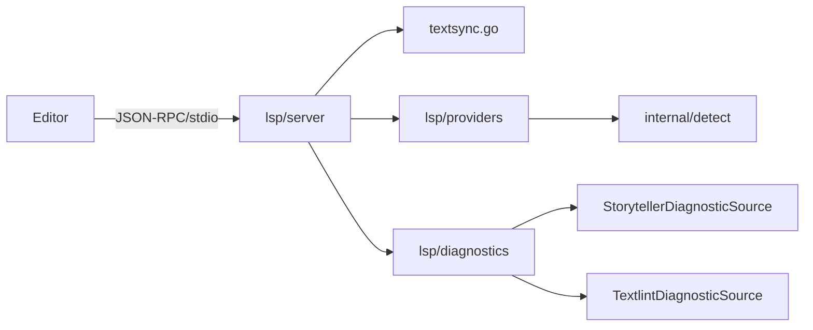

# LSP (Language Server Protocol)

`storyteller` LSP サーバは Go で実装されている (`internal/lsp/`)。原稿（Markdown）内のキャラクター・設定・伏線参照のリアルタイム検出、定義ジャンプ、ホバー、診断、Code Action を提供する。

> 関連: [architecture.md](./architecture.md) / [cli.md](./cli.md) / [lint.md](./lint.md) / [benchmarks.md](./benchmarks.md)

## クイックスタート

```bash
# stdio で LSP を起動（エディタからの呼び出し用）
storyteller lsp start --stdio
storyteller lsp start --stdio --root samples/cinderella

# ワンショット検証
storyteller lsp validate manuscripts/chapter01.md

# エディタ設定生成
storyteller lsp install nvim
storyteller lsp install vscode
```

性能ベースライン（startup < 2s 等）は [benchmarks.md](./benchmarks.md) を参照。Go バイナリ移植により Deno 版より大幅に高速化されている。

## アーキテクチャ

| パッケージ | 役割 |
|-----------|------|
| `internal/lsp/server` | JSON-RPC ループ、ライフサイクル、TextSync、capabilities |
| `internal/lsp/protocol` | LSP 型・JSON-RPC エンベロープ |
| `internal/lsp/providers` | `definition`, `hover` などのリクエスト処理 |
| `internal/lsp/diagnostics` | DiagnosticSource 抽象化と統合 |
| `internal/detect` | エンティティ参照検出（@付き / @なし日本語） |



## サポートする LSP メソッド

| Method | 実装 | 概要 |
|--------|------|------|
| `initialize` / `initialized` | `server/lifecycle.go`, `server/capabilities.go` | サーバ能力宣言 |
| `shutdown` / `exit` | `server/lifecycle.go` | 終了 |
| `textDocument/didOpen` | `server/textsync.go` | ドキュメント取り込み |
| `textDocument/didChange` | 〃 | 増分同期 |
| `textDocument/didClose` | 〃 | クローズ |
| `textDocument/definition` | `providers/definition.go` | 定義ジャンプ |
| `textDocument/hover` | `providers/hover.go` | ホバー |
| `textDocument/codeAction` | `providers/` (in-progress) | 低信頼度参照 → 明示参照変換 |
| `textDocument/publishDiagnostics` | `diagnostics/generator.go` | 診断 push |
| `textDocument/semanticTokens/full` | `providers/semantic_tokens.go` | キャラクター / 設定 / 伏線ハイライト |

## Go 移植版の起動フロー

`storyteller lsp start --stdio` は CWD をプロジェクトルートとして扱い、`--root <path>` または `--root=file:///...` で明示指定できる。起動時に `server.NewServerOptions` が `.storyteller.json` と `src/{characters,settings,foreshadowings}` を読み込み、以下の依存を組み立てる。

| 依存 | 用途 |
|------|------|
| `Catalog` | `internal/detect` の名前検出 |
| `Lookup` | hover 表示内容の解決 |
| `Locator` | 定義ジャンプ先 URI の解決 |
| `Aggregator` | `publishDiagnostics` の統合 |

プロジェクトがまだ初期化されていない場合も、空の fallback catalog で起動する。これによりエディタセッション自体は壊さず、provider は null または空配列を返す。

Neovim での確認例:

```bash
storyteller lsp start --stdio --root samples/cinderella
```

`samples/cinderella/manuscripts/chapter01.md` を開き、`シンデレラ` にカーソルを置いて `vim.lsp.buf.definition()` または `,cd` を実行すると `samples/cinderella/src/characters/cinderella.ts` へジャンプする。`vim.lsp.buf.hover()` または `,ck` ではキャラクター名と summary が表示される。

Semantic Tokens の legend:

| 種別 | 値 |
|------|----|
| token types | `character`, `setting`, `foreshadowing` |
| token modifiers | `highConfidence`, `mediumConfidence`, `lowConfidence`, `planted`, `resolved` |

## DiagnosticSource 抽象化

複数の診断ソースを統合する設計。

```go
// internal/lsp/diagnostics
type Source interface {
    Name() string
    Available(ctx context.Context) bool
    Generate(ctx context.Context, uri string, content string, projectRoot string) ([]Diagnostic, error)
    // optional: Cancel(), Dispose()
}
```

実装済み:

| Source | 役割 |
|--------|------|
| `StorytellerDiagnosticSource` | 未定義キャラ / 設定参照、ID 不整合の検出 |
| `TextlintDiagnosticSource` | 文法・表記ゆれ（`internal/external/textlint`） |

textlint 未インストール環境では `Available()` が false を返し、graceful degradation する（storyteller 診断のみで動作）。詳細は [docs/lint.md](./lint.md)。

## 検出パターン

```markdown
勇者は剣を抜いた。   → src/characters/hero.ts (confidence: 0.90)
@勇者は剣を抜いた。  → src/characters/hero.ts (confidence: 1.00)
王都の城門前で…      → src/settings/royal_capital.ts (confidence: 0.85)
```

`internal/detect/` が `displayNames` / `aliases` / `detectionHints` を参照して信頼度を算出。低信頼度参照は Code Action で明示参照（`@id`）への置換を提案する。

## エディタ統合

### Neovim

`storyteller lsp install nvim` が以下相当の Lua 設定を出力:

```lua
local lspconfig = require('lspconfig')
local configs = require('lspconfig.configs')

if not configs.storyteller then
  configs.storyteller = {
    default_config = {
      cmd = { 'storyteller', 'lsp', 'start', '--stdio' },
      filetypes = { 'markdown' },
      root_dir = lspconfig.util.root_pattern('deno.json', '.git'),
    },
  }
end
lspconfig.storyteller.setup({})
```

### VSCode

`storyteller lsp install vscode` が `.vscode/settings.json` 用設定を出力。LSP クライアント拡張からの利用を想定。

## ワンショット検証

```bash
storyteller lsp validate manuscripts/chapter01.md
storyteller lsp validate --dir manuscripts/ --recursive
storyteller lsp validate --json
```

JSON 出力:
```json
{
  "type": "diagnostics",
  "files": [
    {
      "uri": "file:///.../chapter01.md",
      "diagnostics": [
        { "range": {...}, "severity": 2, "message": "未定義のキャラ参照: 勇者", "source": "storyteller" }
      ]
    }
  ]
}
```

## 性能

| 指標 | 目標 | 出典 |
|------|------|------|
| startup | < 2s | [benchmarks.md](./benchmarks.md) |
| didChange → publishDiagnostics | < 200ms (debounce 込み) | 〃 |

textlint 連携は 500ms デバウンス + 30s タイムアウト + 自動キャンセル（`internal/external/textlint/worker.go`）。

## トラブルシューティング

| 症状 | 原因 / 対処 |
|------|------------|
| 定義ジャンプが動かない | TS authoring ファイル（`src/characters/*.ts` 等）が存在しているか確認 |
| textlint 診断が出ない | `npx textlint --version` で導入確認。出ない場合は graceful degradation 動作中 |
| 全部の参照が低信頼度 | `displayNames` / `aliases` を充実させる |
